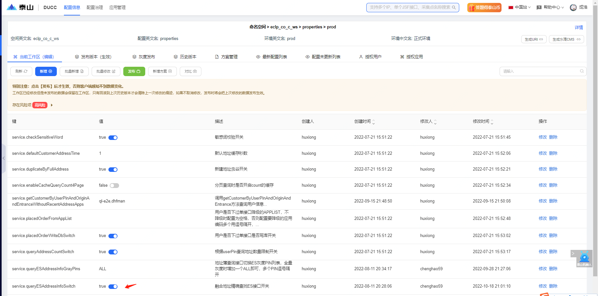

# 1.C2C地址簿列表接口异常

## 1.1问题告警

- 告警采集点：eclp.FusionAddressJsfServiceImpl.queryAddressInfoByCondition
- 问题表现：收到ump监控告警，可用率异常或者tp99升高
- UMP链接：[C2C地址簿列表查询](http://taishan.jd.com/ump/monitor/perfomance?endPointKey=com.jd.mrd.b.rpc.cms.ContentApiRpc.getContentsFromCms)

## 1.2应急方案

1. 目前该接口走的es查询，若性能出现问题，可以先切回db，再分析es集群性能问题
2. 先登录[ducc配置系统](http://taishan.jd.com/ducc/web/namespacework?nsId=10827&nsName=eclp_co_c_ws&cId=97694&cName=properties&envId=124687&envName=prod&defAppId=10430&dataType=0&nsnav=0) 如下图所示

3.修改service.queryESAddressInfoSwitch配置项的值true改为false,true代表走es查询，false代表走数据库查询，修改完毕点击发布即可