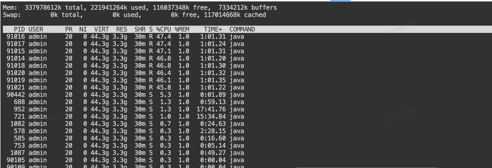

# 场景：应用服务器-CPU利用率飙高

#### 应急场景：

应用服务器CPU利用率飙高，系统报警

#### 启动条件：

UMP、MDC报警 利用率超过80%不下降

#### 应急方案：

重启告警服务器，观察是否恢复

#### 处理步骤：

保留1台问题服务器，拆除JSF流量、NP流量，用于故障分析。

- **应用服务器-摘除流量**
  - JDOS平台操作JSF下线
  - NP平台操作机器冷备
  - JMQ流量剔除
    - JMQ2【监控】-【消费监控】-【操作】-【禁止IP消费】
    - JMQ4【并行消费、批量大小、禁止消费IP】

其余服务器操作：

1. 访问JDOS平台，【实例列表】【容器状态】，找到宕机服务器，状态为红色。

2. 选中宕机服务器，如下图，点击【重启】按钮

问题未能解决情况

1. 检查是否有异常流量进入、JSF、JMQ 

2. 接口调用次数告警，配置限流

   - **准备信息**
     - 接口信息：接口全路径、方法名
     
     - 服务别名：应用对外提供的JSF别名
     
     - 调用方应用：可针对性控制某个应用的调用
     
     - 流量规则：限流触发阈值条件，限流总值
     
   - **限流操作**
     - 单机限流控制
     - 集群限流控制

3. 数据库查询大报文等，溯源找到触发位置，阻止触发（JMQ/Worker/JSF/REST）

4. 识别消耗CPU线程，找到代码分析原因

   - **应用JVM异常分析**

     - 登录服务器，找到消耗CPU进程。进入到终端页面，执行 ps -ef|grep java 命令，找到JVM的进程id 为 571

     - 执行 top -H -p 571 命令，找到消耗CPU的线程（%CPU 值较大的对应PID）

       

     - 选取其中一个线程id，执行 top -H -p 571printf '%x\n' 91020 , 将线程ID转换成16进制 1638c
     
     - 在jdos上面执行jstack，拿到线程堆栈执行情况
     
       
     
       
     
     - 在线程堆栈中找到 1638c的线程情况
     
     - 依次查找其他几个消耗CPU较高的线程的执行情况
     
     - 通过堆栈信息，识别产生问题的代码，再分析真正原因
     

# 场景：内存利用率飙高

#### 应急场景：

应用服务器-内存利用率飙高

#### 启动条件：

收到UMP、MDC内存利用率告警，超80%

#### 应急方案：

重启应用

#### 处理步骤：

重启告警服务器

保留1台问题服务器，拆除JSF流量、NP流量，用于故障分析。

其余服务器操作：

1. 访问JDOS平台，【实例列表】【容器状态】，找到宕机服务器，状态为红色。

2. 选中宕机服务器，如下图，点击【重启】按钮

3. 通过启动日志检查应用是否正常启动

4. 是否收到心跳存活恢复的提醒、邮件

5. 访问服务器，检查是否有dump文件输出，分析文件内容

6. 检查Logbook历史日志，是否有异常痕迹。

检查内存增长情况

   在[UMP]或[MDC]平台，检查服务器内存增长情况，短时间是否还有暴涨情况。

不重启服务器方式

在jdos中，查找进程，关键字java，执行JMap-histo(触发fullgc)方式解决。

# 场景：JSF超时/TP99飙高

## 业务恢复

1. 2023-04-11 20:35:00 收到TP99飙升报警。
2. 2023-04-11 20:35:40查询ump平台，发现接口tp99持续飚高。
3. 2023-04-11 20:37:00 下线对应机器的jsf服务。
4. 2023-04-11 20:41:00  观察对应IP的TP99指标恢复正常后，重启对应的机器。
5. 2023-04-11 20:41:40 ，查看jsf服务，恢复正常。

## 根因定位

1. 2023-04-11 20:35:00 收到TP99飙升报警
2. 2023-04-11 20:35:30 通过物流智能运维平台查询对应应用是否存在慢SQL，经查询，不存在慢SQL
3. 2023-04-11 20:36:00由PFinder调用链跟踪查询耗时过长的方法，如下：
4. 2023-04-11 20:36:10 点击调用链详情，如下：
5. 2023-04-11 20:36:30  由jdos进程查询，执行jstack指令，导出堆栈信息
6. 2023-04-11 20:38:00 由 TIMED_WAITING 检索出和该jsf接口相关的方法的耗时过长的方法，如下：
