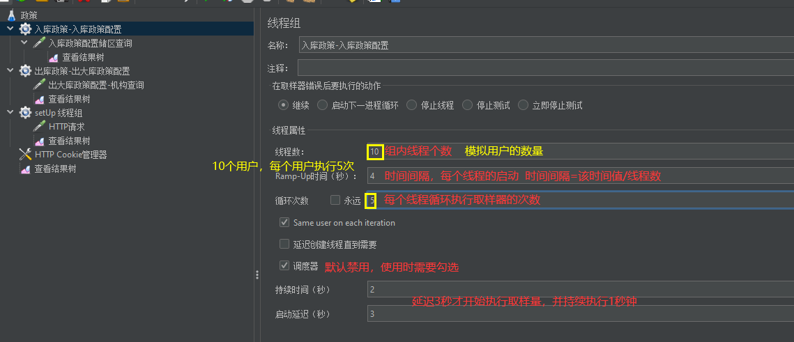
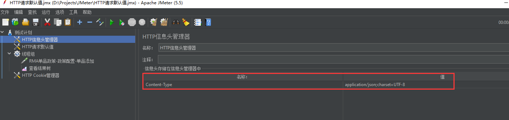
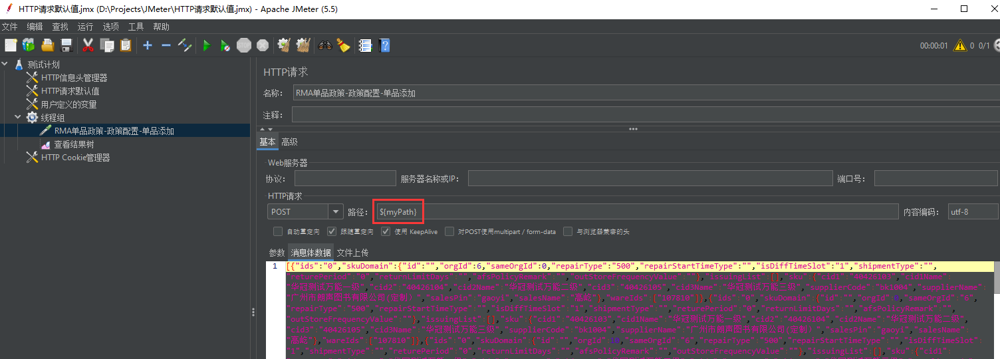
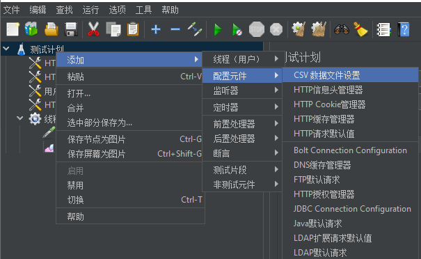
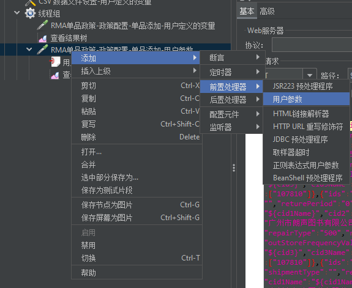
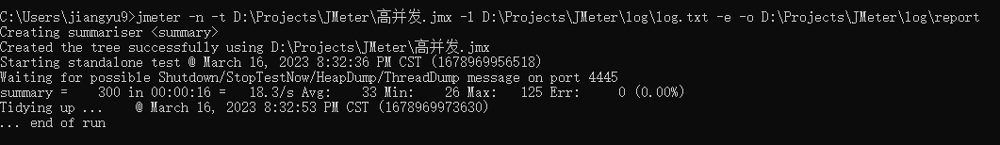

# **Jmeter优缺点**

优点：

1. 开源、免费 2. 跨平台
2. 支持多协议 4. 小巧
3. 功能强大

缺点：

1. 不支持IP欺骗
2. 使用JMeter无法验证JS程序，也无法验证页面UI，所以要和Selenium配合来完成Web2.0应用的测试

# **安装和启动**

JMeter修改编码集

中文乱码问题，请先修改编码集。bin目录下jmeter.properties

```java
修改前
# The encoding to be used if none is provided (default ISO-8859-1)
#sampleresult.default.encoding=ISO-8859-1

修改后
# The encoding to be used if none is provided (default ISO-8859-1)
sampleresult.default.encoding=UTF-8
```

**启动并运行JMeter**

- 图形化启动

bin目录下，ApacheJMeter.jar

- windows下启动

bin目录下，jmeter.bat

- Linux下启动

bin目录下，jmeter.sh

# **JMeter基本使用**

设置接口三要素查询所有学院信息：

1、测试计划--右键--线程--添加线程组

2、线程组--右键--取样器--http请求

3、测试计划--右键--添加监听器--查看结果树

4、点击运行，查看结果


# **JMeter线程组相关**

进 程: 正在运行的程序

线 程: 是进程中的执行线索

线程组: 进程中有许多线程，为了方便管理，可以对线程按照性质分组，分组的结果就是线程组

PS: 三者关系，一个进程可以包含多个线程组，一个线程组可以包含多个线程

# **JMeter并发执行和顺序执行**

并发执行: 多个线程同时执行

顺序执行: 多个线程顺序执行

勾选测试计划中的独立运行每个线程组，并发改为顺序执行


# **JMeter两个特殊线程组**

setUp线程组：最优先执行的线程组

tearDown线程组：最后执行的线程组

# **JMeter线程组常用属性**



# HTTP请求默认值

http请求默认值：被复用的内容的封装


# **信息头管理器**

新增修改实现时提交的数据是 JSON 格式的，需声明提交的数据的内容类型：




# **参数化**

当提交的数据量较大，怎么提交?每测试一次就修改一次吗?

定义：动态的获取、设置或生成数据，是一种由程序驱动代替人工驱动的数据设计方案，提高脚本的编写效率以及编写质量

以下四种方式实现参数化：

1. **用户定义的变量**

   

   

   

2. **CSV 数据文件设置**

   CSV ：逗号分隔值，是一种简洁且常见的数据存储格式，存储语法如下图所示

   

   实现步骤:

   1、使用 CSV 文件存储测试数据

   2、编写脚本模板

   注意: 编码集使用 UTF-8 无 BOM 格式

   

   3、关联脚本与数据(将文件数据导入脚本)

   

   不确定有几条数据，勾选永远；确定几条数据，可以填写具体次数

   

   CSV数据文件设置属性

   

3. **用户参数**

   

   实现步骤:

   1、编写脚本模板

   2、使用用户参数存储测试数据

   

   3、将数据导入脚本模板

   4、设置执行次数

   线程组中线程数设置为2，通过线程数而非循环次数控制脚本执行次数

   

4. **函数**

   常见函数：

   __counter 计数器函数 TRUE(每个用户都有自己的计数器) FALSE(所有用户共用一个计数器)

   __Random 随机数函数 参数1：取值范围最小值(包含) 参数2：取值范围最大值(包含)

   __time 获取当前时间的函数 无参: 获取的是距离 1970/01/01 00:00:00 的毫秒值

   参数1: yyyyMM_dd HH:mm:ss 格式化成 年\月_日 时:分:秒 格式

   示例1：当设置2个用户，每个用户执行3次。在结果里想查看每个用户执行的具体次数，也就是每个人有独立的计数器

   

   打开函数助手->选择函数->为函数传参->生成并复制调用函数格式->函数运行结果预览

   

   请求处粘贴调用函数格式

   

   运行

   

   示例二：看总共执行多少次，也就是所有人共用一个计数器

   

   示例三：添加时间

   

   

# **直连数据库**

通过直连数据库让程序代替接口访问数据库，如果二者预期结果不一致，就找到了程序缺陷。

1、Jmeter 不具备直连数据库功能，必须整合第三方( jar包)实现，配置数据库的连接

- jmeter要连接mysql数据库，首先得下载mysql jdbc驱动包，尽量保证其版本和你的数据库版本一致，至少不低于数据库版本，否则可能有问题。官网下载地址为：https://dev.mysql.com/downloads/connector/j/

  

- 解压后把jdbc驱动jar包引入测试计划，点击测试计划-->点击浏览-->选中mysql驱动jar包-->打开，如下图所示：

  

- 配置JDBC Connection Configuration

  在线程组下新建一个JDBC Connection Configuration配置元件，需要用到这个元件来完成数据库的连接，详细配置如下图所示：

  

  2、通过JDBC Request请求向数据库发送 SQL语句并接收提取响应结果

  


Query： 填写要被执行的SQL语句

Parameter values：参数值

Parameter types：参数类型

Variable names：保存sql语句返回结果的变量名

Result variable name：创建一个对象变量，保存所有返回的结果

Query timeout：查询超时时间

Handle result set：定义如何处理由callable statements语句返回的结果


3、结果获取规则可以通过 Debug Sampler 组件查看


通过JDBC Request获取到的结果以val为前缀进行数据的保存


4、将提取到的响应结果，在其他请求中使用


# **断言**

断言：让程序代替人工判断响应结果是否符合预期

步骤：

1、按照之前的实现编写测试脚本

2、为被判断的取样器添加断言组件

3、直接运行查看结果。断言通过: 无提示，断言失败: 给出错误

# **逻辑控制器**

通过参数化可以实现单个接口的功能测试，而接口测试过程中，除了单个接口的功能测试之外，还会测试接口业务实现，所谓业务，就是一套完整的业务逻辑或流程，这就必须要使用到逻辑控制和关联。

需求1:测试计划中定义一个 http 请求，但是该请求不是无条件执行的，声明一个用户定义的变量，如果变量是 itcast 才执行，否则就不执行

1. 搭框架，测试计划，线程组，结果树，声明一个用户定义的变量

   

2. 核心:添加 if 控制器，子级添加取样器 (和之前实现不同，控制器和取样器存在父子级关系)

   

需求2:有一组关键字 [广州分公司,上海分公司,成都分公司] (使用用户定义的变量存储)要依次取出，并在系统搜索

1. 搭框架，测试计划，线程组，结果树，声明一个用户定义的变量,存储一组数据

   

2. 添加 forEach 控制器，子级添加取样器 (和之前实现不同，控制器和取样器存在父子级关系)

   

3. 系统搜索关键字

   

需求3:循环访问系统10次

实现:

1. 搭框架，测试计划，线程组，结果树

2. 添加循环控制器，子级添加取样器 (和之前实现不同，控制器和取样器存在父子级关系)

   HTTP请求1执行3次，HTTP请求2执行5次


# **关联**

关联: 上一个请求的响应结果和下一个请求的数据有关系

需求:两个http请求，请求A访问传智播客官网，请求B访问百度 ，请求A将传智播客官网源码中的 title 标签的值取出，传递给请求B，在请求B中作为关键字搜索这个 title 值

步骤：

1. 搭框架,编写两个请求，传智播客 + 百度搜索

2. 核心: 取出传智播客页面源码的 title 值

   

   

3. 传递给百度：${变量名} 的方式传值

   

   运行结果

   


# **关联-正则表达式提取器**

需求:两个http请求，请求A查询一级分类id，请求B根据一级分类查询详细信息 

步骤：

1. 搭框架,编写两个请求

2. 核心: 取出查询一级分类id值

   

   

3. 传递给请求B：${变量名} 的方式传值

   

# **跨线程组关联**

变量作用域局限于当前线程组，其他线程组不可以直接调用。可以将请求A中提取的结果导出到公共空间(可以被不同线程组共享),请求B再从公开空间调用该变量，相当于全局变量。

步骤：

注意：测试计划中先勾选独立运行每个线程组


1. 将请求A的数据导出到公共空间( __setProperty)

   函数助手，选择setProperty，设置值后，点击生成

   

2. 把代码放在beanshell取样器中

   

   

3. 请求B从公共空间调用数据 (__property)

   

   

# **性能测试**

模拟各种正常的、峰值的测试环境，检测程序的各项性能指标是否能够达标

# **高并发**

JMeter 中内置了 定时器，可以实现时间模式相关的性能测试

需求1:同一时刻 100 个用户查询一级分类功能,统计高并发情况下平均响应时间以及错误率(高并发)

1. 搭框架,测试计划，线程组，取样器，结果树(局限性),指定线程组的线程数属性值为 100

   

   

2. 添加定时器 synchronizing timer(集合点组件)

   

   同步定时器

   

3. 运行并查看结果查看：聚合报告组件,可以对结果汇总分析

   

# **高频率**

需求2:一个用户以 20QPS ( == 20 次/s) 的频率访问XXX系统服务器，持续15秒，统计服务器的平均响应时间

QPS: Query per Seconds 每秒查询数(查询率),每秒访问多少次服务器

1. 搭框架，测试计划，线程组，取样器，聚合报告,根据题干计算数据:

   循环次数 = 访问频率 * 持续时间

   

   填写循环次数

   

2. 添加QPS访问频率控制的相关组件：

   每分钟访问次数 = 访问频率 * 60

   

# **生成图形化测试报告**

在 JMeter 中可以以图形化（饼状图、柱状图...）的方式显示脚本运行结果，较之于聚合报告或查看结果

树组件实

现更直观，用户体验更友好

生成图形化测试报告

命令: jmeter -n -t 脚本文件 -l 日志文件 -e -o 目录

-n 无图形化运行

-t 被运行的脚本

-l 将运行信息写入日志文件，生成.jtl格式的测试报告

-e 生成测试报告

-o 指定报告输出目录



# **分布式**

多台机协作，以集群的方式完成测试任务，可以提高测试效率。


环境搭建：

1、不同的测试机上安装 Jmeter

2、配置基础环境(统一操作系统、JDK、Jmeter .... )

3、核心: 控制机如何与执行机通信? 关键点：端口号

4、控制机中设置执行机的 IP

%JMETER_HOME%/bin/jmeter.properties ----> remote_hosts=执行机A的IP:端口号, 执行机B的IP:端口号, .....

打开JMETER安装目录，\bin\jmeter.properties修改配置文件


5、控制机和执行机都得设置远程访问相关属性：

server.rmi.ssl.disable=true


6、执行机Jmeter保持启动状态下，控制机远程启动所有


# **Ant与jmeter集成**

1. Ant环境变量配置

2. jmeter目录下的扩展文件夹\extras\ant-jmeter-1.1.1.jar复制到\ant\lib目录下

3. 全局配置

   - Jmeter配置文件

     .jtl格式基于xml文件格式，所以需要修改bin目录下jmeter.properties

     ```java
     修改前
     #jmeter.save.saveservice.output_format=csv
     
     修改后
     jmeter.save.saveservice.output_format=xml
     ```

   - jmeter是否保存响应数据，不是必须

     ```java
     修改前
     #jmeter.save.saveservice.response_data=false
     
     修改后
     jmeter.save.saveservice.response_data=true
     ```

   - jmeter是否保存采样器数据，不是必须

     ```java
     修改前
     #jmeter.save.saveservice.samplerData=false
     
     修改后
     jmeter.save.saveservice.samplerData=true
     ```

   - 配置build.xml文件（指导ant命令如何去执行jmx测试用例以及如何生成html报告）

   文件拷贝到脚本目录，执行ant即可

   ```html
   <?xml version="1.0" encoding="UTF-8"?>
    
   <project name="ant-jmeter-test" default="run" basedir=".">
       <tstamp>
           <format property="time" pattern="yyyyMMddhhmm" />
       </tstamp>
     
       <target name="run">
              <antcall target="clear1" />
       <antcall target="test1" />
               <antcall target="report1" />
       <antcall target="sendmail1" />
       </target>
       
       <target name="test1">
             <echo message="开始执行jmeter脚本..."></echo>
           <taskdef name="jmeter" classname="org.programmerplanet.ant.taskdefs.jmeter.JMeterTask" />
           <jmeter jmeterhome="D:\DeveloperConfig\apache-jmeter-5.5" resultlog="D:\DeveloperConfig\apache-jmeter-5.5\TestSuite\copy\result\ant_jmeter_test_report.jtl">
                <!-- 声明要运行的脚本。"*.jmx"指包含此目录下的所有jmeter脚本-->
               <testplans dir="D:\DeveloperConfig\apache-jmeter-5.5\TestSuite\script" includes="*.jmx" />
           <property name="jmeter.save.saveservice.output_format" value="xml"/>
           </jmeter>
       </target>
           
            <path id="xslt.classpath">
           <fileset dir="D:\DeveloperConfig\apache-jmeter-5.5\lib" includes="xalan*.jar"/>
           <fileset dir="D:\DeveloperConfig\apache-jmeter-5.5\lib" includes="serializer*.jar"/>
       </path>
       
       <target name="report1">
       <echo message="开始转换执行结果..."></echo>
       <tstamp> <format property="time" pattern="yyyy/MM/dd HH:mm" /></tstamp>
           <xslt classpathref="xslt.classpath"
                 force="true"
        in="D:\DeveloperConfig\apache-jmeter-5.5\TestSuite\copy\result\ant_jmeter_test_report.jtl"
                 out="D:\DeveloperConfig\apache-jmeter-5.5\TestSuite\copy\html\ant_jmeter_test_report.html"
                 style="D:\DeveloperConfig\apache-jmeter-5.5\extras\jmeter-results-detail-report_21.xsl">
                   <param name="titleReport" expression="测试报告"/> 
                   <param name="dateReport" expression="${time}"/>  
          </xslt>  
                       <!-- jmeter-results-detail-report_21  因为上面生成报告的时候，不会将相关的图片也一起拷贝至目标目录，所以，需要手动拷贝--> 
           <copy todir="D:\DeveloperConfig\apache-jmeter-5.5\TestSuite\copy\html">
               <fileset dir="D:\DeveloperConfig\apache-jmeter-5.5\extras">
                   <include name="collapse.png" />
                   <include name="expand.png" />
               </fileset>
           </copy>            
       </target>
    
           <target name="clear1">
       <!-- 每次执行前先删除清空jtl和html文件夹，释放空间 -->
           <echo message="释放空间,清空jtl和html文件夹中 ..."></echo>
           <delete dir="D:\DeveloperConfig\apache-jmeter-5.5\TestSuite\copy\result" />
           <delete dir="D:\DeveloperConfig\apache-jmeter-5.5\TestSuite\copy\html" />
           <!-- 删除单个文件-->
           <delete file="D:\DeveloperConfig\apache-jmeter-5.5\TestSuite\copy\ant_jmeter_test_report.rar" />
           <sleep seconds="2"/>  
           <echo message="释放完成 ..."></echo>
       </target>
    
    
       <target name="sendmail1">
       <!--把报告进行压缩打包-->
       <jar jarfile="D:\DeveloperConfig\apache-jmeter-5.5\TestSuite\copy\ant_jmeter_test_report.rar" basedir="D:\DeveloperConfig\apache-jmeter-5.5\TestSuite\copy\html"/>
       <!--把文件贴到邮件正文-->
       <loadfile property="html" srcFile="D:\DeveloperConfig\apache-jmeter-5.5\TestSuite\copy\html\ant_jmeter_test_report.html" encoding="UTF-8">
       <filterchain>
               <expandproperties />
           </filterchain>
       </loadfile>
       
       <mail mailhost="smtp.qq.com" 
       mailport="25" subject="邮件标题" 
       messagemimetype="text/html" tolist="收件邮箱1,收件邮箱2,收件邮箱3"
       user="发件邮箱" password="授权码(可在邮箱设置中找到)">
       <from address="发件邮箱"/>
       <!--发送附件-->
       <fileset dir="D:\DeveloperConfig\apache-jmeter-5.5\TestSuite\copy">
               <include name="ant_jmeter_test_report.rar"/>
          </fileset>
       <message><![CDATA[ 
       <p>项目组收：
               这是正文最前面(可任意填写邮件正文)
       </p>
       <pre> ${html} </pre>
       <p>"这是正文最后面(可任意填写邮件正文)"</p>
       ]]></message>
       </mail>
       </target>
   </project>
   ```

   build.xml可进一步优化项如下：

   优化一：报告名称、压缩包名称变更

   ant_jmeter_test_report(尾缀有.jtl,.html,.rar)：报告名称、压缩包名称。(存在于第18行、第35行、第36行、第56行、第64行、第66行、第79行)

   PS:如果需要更改ant_jmeter_test_report名称时，尽量全部都同步更新，使用替换操作即可方便更换。

   优化二：编写邮件标题

   第73行：subject="邮件标题"

   优化三：添加多个收件邮箱

   第75行：tolist="设置多个收件邮箱，使用英文逗号隔开，注意只能在最外层有双引号"

   例如：tolist="123@qq.com,456@qq.com,789@qq.com"

   优化四：编写邮件正文内容

   第82-86行：可以任意编写邮件正文内容。