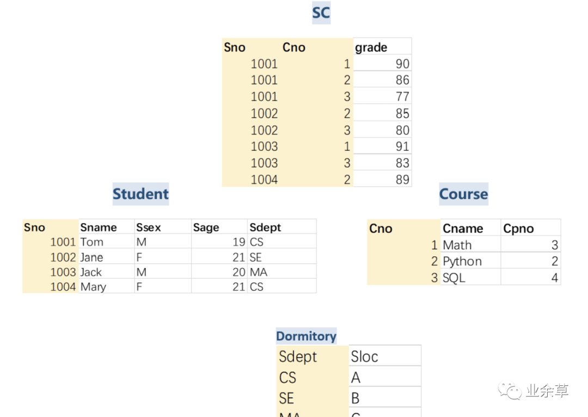

## 数据库对象命名规范

### 数据库对象

数据库对象是数据库的组成部分，常见的有以下几种：表（Table ）、索引（Index）、视图（View）、图表（Diagram）、缺省值（Default）、规则（Rule）、触发器（Trigger）、存储过程（Stored Procedure）、 用户（User）等。命名规范是指数据库对象如数据库（SCHEMA）、表（TABLE）、索引（INDEX）、约束（CONSTRAINTS）等的命名约定。

### 数据库对象全局命名规范

1、命名使用具有意义的英文词汇，词汇中间以下划线分隔

2、命名只能使用英文字母、数字、下划线，以英文字母开头

3、避免用MySQL的保留字如：backup、call、group等

4、所有数据库对象使用小写字母，实际上MySQL中是可以设置大小写是否敏感的，为了保证统一性，我们这边规范全部小写表示。

### 数据库命名规范

1、数据库命名尽量不超过30个字符。

2、数据库命名一般为项目名称+代表库含义的简写，比如IM项目的工作流数据库，可以是 im_flow。

3、数据库创建时必须添加默认字符集和校对规则子句。默认字符集为UTF8（已迁移dumbo的使用utf8mb4）

4、命名应使用小写。

### 表命名规范

1、常规表表名以t_开头，t代表table的意思，命名规则即 t + 模块（包含模块含义的简写）+ 表（包含表含义的简写），比如用户模块的教育信息表：t_user_eduinfo。

2、临时表（RD、QA或DBA同学用于数据临时处理的表），命名规则：temp前缀+模块+表+日期后缀：temp_user_eduinfo_20210719

3、备份表（用于保存和归档历史数据或者作为灾备恢复的数据）命名规则，bak前缀+模块+表+日期后缀：bak_user_eduinfo_20210719

4、同一个模块的表尽可能使用相同的前缀，表名称尽可能表达含义

5、多个单词以下划线 _ 分隔

6、常规表表名尽量不超过30个字符，temp表和bak表视情况而定，也尽量简短为宜，命名应使用小写

### 字段命名规范

1、字段命名需要表示其实际含义的英文单词或简写，单词之间用下划线 _ 进行连接，如 service_ip、service_port。

2、各表之间相同意义的字段必须同名，比如a表和b表都有创建时间，应该统一为create_time，不一致会很混乱。

3、多个单词以下划线 _ 分隔

4、字段名尽量不超过30个字符，命名应该使用小写

### 索引命名规范

1、唯一索引使用uni + 字段名 来命名：create unique index uni_uid on t_user_basic(uid) 。

2、非唯一索引使用idx + 字段名 来命名：create index idx_uname_mobile on t_user_basic(uname,mobile) 。

3、多个单词以下划线 _ 分隔。

4、索引名尽量不超过50个字符，命名应该使用小写，组合索引的字段不宜太多，不然也不利于查询效率的提升。

5、多单词组成的列名，取尽可能代表意义的缩写，如 test_contact表member_id和friend_id上的组合索引：idx_mid_fid。

6、理解组合索引最左前缀原则，避免重复建设索引，如果建立了(a,b,c)，相当于建立了(a), (a,b), (a,b,c)。

### 视图命名规范

1、视图名以v开头，表示view，完整结构是v+视图内容含义缩写。

2、如果视图只来源单个表，则为v+表名。如果视图由几个表关联产生就用v+下划线（_）连接几个表名，视图名尽量不超过30个字符。如超过30个字符则取简写。

3、如无特殊需要，严禁开发人员创建视图。

4、命名应使用小写。

### 存储过程命名规范

1、存储过程名以sp开头，表示存储过程（storage procedure）。之后多个单词以下划线（_）进行连接。存储过程命名中应体现其功能。存储过程名尽量不能超过30个字符。

2、存储过程中的输入参数以i_开头，输出参数以o_开头。

3、命名应使用小写。

```
create procedure sp_multi_param(
    in i_id bigint,
    in i_name varchar(32),
    out o_memo varchar(100)
)
```

### 函数命名规范

1、函数名以func开始，表示function。之后多个单词以下划线（_）进行连接，函数命名中应体现其功能。函数名尽量不超过30个字符。

2、命名应使用小写。

```
create function func_format_date(ctime datetime)
```

### 触发器命名规范

1、触发器以trig开头，表示trigger 触发器。

2、基本部分，描述触发器所加的表，触发器名尽量不超过30个字符。

3、后缀（_i,_u,_d）,表示触发条件的触发方式（insert,update或delete）。

4、命名应使用小写。

```
DROP TRIGGER IF EXISTS trig_attach_log_d;   
CREATE TRIGGER trig_attach_log_d AFTER DELETE ON t_dept FOR EACH ROW;
```

### 约束命名规范

1、唯一约束：uk_表名称_字段名。uk是UNIQUE KEY的缩写。比如给一个部门的部门名称加上唯一约束，来保证不重名，如下：ALTER TABLE t_dept ADD CONSTRAINT un_name UNIQUE(name);

2、外键约束：fk_表名，后面紧跟该外键所在的表名和对应的主表名（不含t_）。子表名和父表名用下划线(_)分隔。如下：ALTER TABLE t_user ADD CONSTRAINT fk_user_dept FOREIGN KEY(depno) REFERENCES t_dept (id);

3、非空约束：如无特殊需要，建议所有字段默认非空(not null)，不同数据类型必须给出默认值(default)。

4、出于性能考虑，如无特殊需要，建议不使用外键。参照完整性由代码控制。这个也是我们普遍的做法，从程序角度进行完整性控制，但是如果不注意，也会产生脏数据。

5、命名应使用小写。

### 用户命名规范

1、 生产使用的用户命名格式为 code_应用

2、 只读用户命名规则为 read_应用

## 数据库对象设计规范

### 存储引擎的选择

1、如无特殊需求，必须使用innodb存储引擎。

可以通过 show variables like 'default_storage_engine' 来查看当前默认引擎。主要有MyISAM 和 InnoDB，从5.5版本开始默认使用 InnoDB 引擎。

基本的差别为：MyISAM类型不支持事务处理等高级处理，而InnoDB类型支持。MyISAM类型的表强调的是性能，其执行速度比InnoDB类型更快，但是不提供事务支持，而InnoDB提供事务支持以及外部键等高级数据库功能。

### 字符集的选择

1、如无特殊要求，必须使用utf8或utf8mb4。

在国内，选择对中文和各语言支持都非常完善的`utf8`格式是最好的方式，MySQL在5.5之后增加utf8mb4编码，mb4就是most bytes 4的意思，专门用来兼容四字节的unicode。

所以utf8mb4是utf8的超集，除了将编码改为utf8mb4外不需要做其他转换。当然，为了节省空间，一般情况下使用utf8也就够了。

可以使用如下脚本来查看数据库的编码格式

```
SHOW VARIABLES WHERE Variable_name LIKE 'character_set_%' OR Variable_name LIKE 'collation%'; 
SHOW VARIABLES Like '%char%';
```

### 表设计规范

1、不同应用间所对应的数据库表之间的关联应尽可能减少，不允许使用外键对表之间进行关联，确保组件对应的表之间的独立性，为系统或表结构的重构提供可能性。目前业内的做法一般 由程序控制参照完整性。

2、表设计的角度不应该针对整个系统进行数据库设计，而应该根据系统架构中组件划分，针对每个组件所处理的业务进行数据库设计。

3、表必须要有PK，主键的优势是唯一标识、有效引用、高效检索，所以一般情况下尽量有主键字段。

4、一个字段只表示一个含义。

5、表不应该有重复列。

6、禁止使用复杂数据类型(数组,自定义等)，Json类型的使用视情况而定。

7、需要join的字段(连接键)，数据类型必须保持绝对一致，避免隐式转换。比如关联的字段都是int类型。

8、设计应至少满足第三范式,尽量减少数据冗余。一些特殊场景允许反范式化设计，但在项目评审时需要对冗余字段的设计给出解释。

9、TEXT字段作为大体量文本存储，必须放在独立的表中 , 用PK与主表关联。如无特殊需要，禁止使用TEXT、BLOB字段。

10、需要定期删除(或者转移)过期数据的表，通过分表解决，我们的做法是按照2/8法则将操作频率较低的历史数据迁移到历史表中，按照时间或者则曾Id做切割点。

11、单表字段数不要太多，建议最多不要大于50个。过度的宽表对性能也是很大的影响。

12、MySQL在处理大表时，性能就开始明显降低，所以建议单表物理大小限制在16GB，表中数据行数控制在2000W内。

业内的规则是超过2000W性能开始明显降低。但是这个值是灵活的，你可以根据实际情况进行测试来判断，比如阿里的标准就是500W，百度的确是2000W。实际上是否宽表，单行数据所占用的空间都有起到作用的。

13、如果数据量或数据增长在前期规划时就较大，那么在设计评审时就应加入分表策略，后续会有专门的文章来分析数据拆分的做法：垂直拆分（垂直分库和垂直分表）、水平拆分（分库分表和库内分表）；

14、无特殊需求，严禁使用分区表

### 字段设计规范

1、INT：如无特殊需要，存放整型数字使用UNSIGNED INT型，整型字段后的数字代表显示长度。比如 `id` int(11) NOT NULL

2、DATETIME：所有需要精确到时间(时分秒)的字段均使用DATETIME,不要使用TIMESTAMP类型。

对于TIMESTAMP，它把写入的时间从当前时区转化为UTC（世界标准时间）进行存储。查询时，将其又转化为客户端当前时区进行返回。而对于DATETIME，不做任何改变，基本上是原样输入和输出。

另外DATETIME存储的范围也比较大：

timestamp所能存储的时间范围为：'1970-01-01 00:00:01.000000' 到 '2038-01-19 03:14:07.999999'。

datetime所能存储的时间范围为：'1000-01-01 00:00:00.000000' 到 '9999-12-31 23:59:59.999999'。

但是特殊情况，对于跨时区的业务，TIMESTAMP更为合适。

3、VARCHAR：所有动态长度字符串 全部使用VARCHAR类型,类似于状态等有限类别的字段,也使用可以比较明显表示出实际意义的字符串,而不应该使用INT之类的数字来代替；VARCHAR(N)，

N表示的是字符数而不是字节数。比如VARCHAR(255)，可以最大可存储255个字符（字符包括英文字母，汉字，特殊字符等）。但N应尽可能小，因为MySQL一个表中所有的VARCHAR字段最大长度是65535个字节，且存储字符个数由所选字符集决定。

如UTF8存储一个字符最大要3个字节，那么varchar在存放占用3个字节长度的字符时不应超过21845个字符。同时，在进行排序和创建临时表一类的内存操作时，会使用N的长度申请内存。(如无特殊需要，原则上单个varchar型字段不允许超过255个字符)

4、TEXT：仅仅当字符数量可能超过20000个的时候,才可以使用TEXT类型来存放字符类数据,因为所有MySQL数据库都会使用UTF8字符集。

所有使用TEXT类型的字段必须和原表进行分拆，与原表主键单独组成另外一个表进行存放，与大文本字段的隔离，目的是。如无特殊需要，不使用MEDIUMTEXT、TEXT、LONGTEXT类型

5、对于精确浮点型数据存储，需要使用DECIMAL，严禁使用FLOAT和DOUBLE。

6、如无特殊需要，尽量不使用BLOB类型

7、如无特殊需要，字段建议使用NOT NULL属性，可用默认值代替NULL

8、自增字段类型必须是整型且必须为UNSIGNED，推荐类型为INT或BIGINT，并且自增字段必须是主键或者主键的一部分。

### 索引设计规范

1、索引区分度

索引必须创建在索引选择性（区分度）较高的列上，选择性的计算方式为:  selecttivity = count(distinct c_name)/count(*) ; 如果区分度结果小于0.2，则不建议在此列上创建索引，否则大概率会拖慢SQL执行

2、遵循最左前缀

对于确定需要组成组合索引的多个字段，设计时建议将选择性高的字段靠前放。使用时，组合索引的首字段，必须在where条件中，且需要按照最左前缀规则去匹配。

3、禁止使用外键，可以在程序级别来约束完整性

4、Text类型字段如果需要创建索引，必须使用前缀索引

5、单张表的索引数量理论上应控制在5个以内。经常有大批量插入、更新操作表，应尽量少建索引，索引建立的原则理论上是多读少写的场景。

6、ORDER BY，GROUP BY，DISTINCT的字段需要添加在索引的后面，形成覆盖索引

7、正确理解和计算索引字段的区分度，文中有计算规则，区分度高的索引，可以快速得定位数据，区分度太低，无法有效的利用索引，可能需要扫描大量数据页，和不使用索引没什么差别。

8、正确理解和计算前缀索引的字段长度，文中有判断规则，合适的长度要保证高的区分度和最恰当的索引存储容量，只有达到最佳状态，才是保证高效率的索引。

9、联合索引注意最左匹配原则：必须按照从左到右的顺序匹配，MySQL会一直向右匹配索引直到遇到范围查询(>、<、between、like)然后停止匹配。

如：depno=1 and empname>'' and job=1 如果建立(depno,empname,job)顺序的索引，job是用不到索引的。

10、应需而取策略，查询记录的时候，不要一上来就使用*，只取需要的数据，可能的话尽量只利用索引覆盖，可以减少回表操作，提升效率。

11、正确判断是否使用联合索引（上面联合索引的使用那一小节有说明判断规则），也可以进一步分析到索引下推（IPC），减少回表操作，提升效率。

12、避免索引失效的原则：禁止对索引字段使用函数、运算符操作，会使索引失效。这是实际上就是需要保证索引所对应字段的”干净度“。

13、避免非必要的类型转换，字符串字段使用数值进行比较的时候会导致索引无效。

14、模糊查询'%value%'会使索引无效，变为全表扫描，因为无法判断扫描的区间，但是'value%'是可以有效利用索引。

15、索引覆盖排序字段，这样可以减少排序步骤，提升查询效率

16、尽量的扩展索引，非必要不新建索引。比如表中已经有a的索引，现在要加(a,b)的索引，那么只需要修改原来的索引即可。

举例子：比如一个品牌表，建立的的索引如下，一个主键索引，一个唯一索引

```
PRIMARY KEY (`id`),   
UNIQUE KEY `uni_brand_define` (`app_id`,`define_id`)
```

当你同事业务代码中的检索语句如下的时候，应该立即警告了，即没有覆盖索引，也没按照最左前缀原则：

```
select brand_id,brand_name from  ds_brand_system where status=?  and define_id=?  and app_id=?
```

建议改成如下：

```
select brand_id,brand_name from  ds_brand_system where app_id=? and define_id=?  and  status=?
```

### 约束设计规范

1、PK应该是有序并且无意义的，由开发人员自定义，尽可能简短，并且是自增序列。

2、表中除PK以外,还存在唯一性约束的,可以在数据库中创建以“uk_”作为前缀的唯一约束索引。

3、PK字段不允许更新。

4、禁止创建外键约束，外键约束由程序控制。

5、如无特殊需要，所有字段必须添加非空约束，即not null。

6、如无特殊需要，所有字段必须有默认值。

## SQL使用规范

### select 检索的规范性

1、尽量避免使用`select *`，join语句使用`select *`可能导致只需要访问索引即可完成的查询需要回表取数。

一种是可能取出很多不需要的数据，对于宽表来说，这是灾难；一种是尽可能避免回表，因为取一些根本不需要的数据而回表导致性能低下，是很不合算。

2、严禁使用 select * from t_name ，而不加任何where条件，道理一样，这样会变成全表全字段扫描。

3、MySQL中的text类型字段存储：

3.1、不与其他普通字段存放在一起,因为读取效率低，也会影响其他轻量字段存取效率。

3.2、如果不需要text类型字段，又使用了select *，会让该执行消耗大量io，效率也很低下

4、在取出字段上可以使用相关函数，但应尽可能避免出现 now() , rand() , sysdate() 等不确定结果的函数，在Where条件中的过滤条件字段上严禁使用任何函数，包括数据类型转换函数。大量的计算和转换会造成效率低下，这个在索引那边也描述过了。

5、分页查询语句全部都需要带有排序条件 , 否则很容易引起乱序

6、用in()/union替换or，效率会好一些，并注意in的个数小于300

7、严禁使用%前缀进行模糊前缀查询:如：`select a,b,c from t_name where a like ‘%name’`; 可以使用%模糊后缀查询如：`select a,b from t_name where a like ‘name%’`;



8、避免使用子查询，可以把子查询优化为join操作

通常子查询在in子句中，且子查询中为简单SQL(不包含union、group by、order by、limit从句)时，才可以把子查询转化为关联查询进行优化。

子查询性能差的原因：

**「·」** 子查询的结果集无法使用索引，通常子查询的结果集会被存储到临时表中，不论是内存临时表还是磁盘临时表都不会存在索引，所以查询性能 会受到一定的影响；

**「·」** 特别是对于返回结果集比较大的子查询，其对查询性能的影响也就越大；

**「·」** 由于子查询会产生大量的临时表也没有索引，所以会消耗过多的CPU和IO资源，产生大量的慢查询。

### 操作的规范性

1、禁止使用不含字段列表的INSERT语句

如：insert into values ('a','b','c');  应使用  insert into t_name(c1,c2,c3) values ('a','b','c'); 。

2、大批量写操作（UPDATE、DELETE、INSERT），需要分批多次进行操作

- 大批量操作可能会造成严重的主从延迟，特别是主从模式下，大批量操作可能会造成严重的主从延迟，因为需要slave从master的binlog中读取日志来进行数据同步。
- binlog日志为row格式时会产生大量的日志