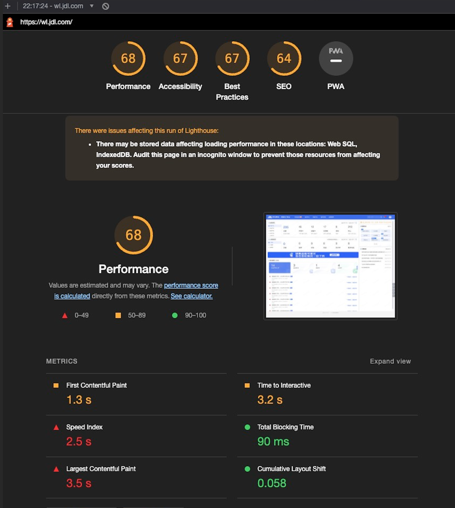
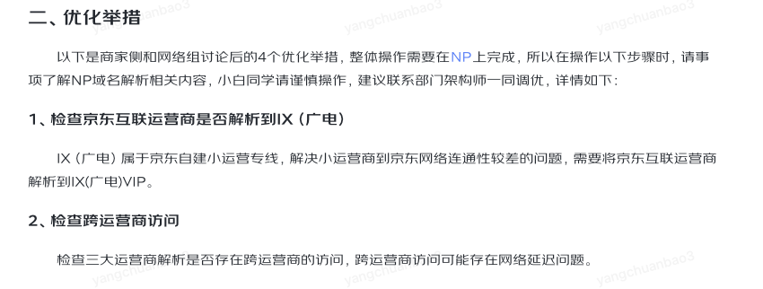
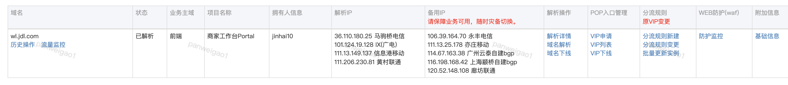
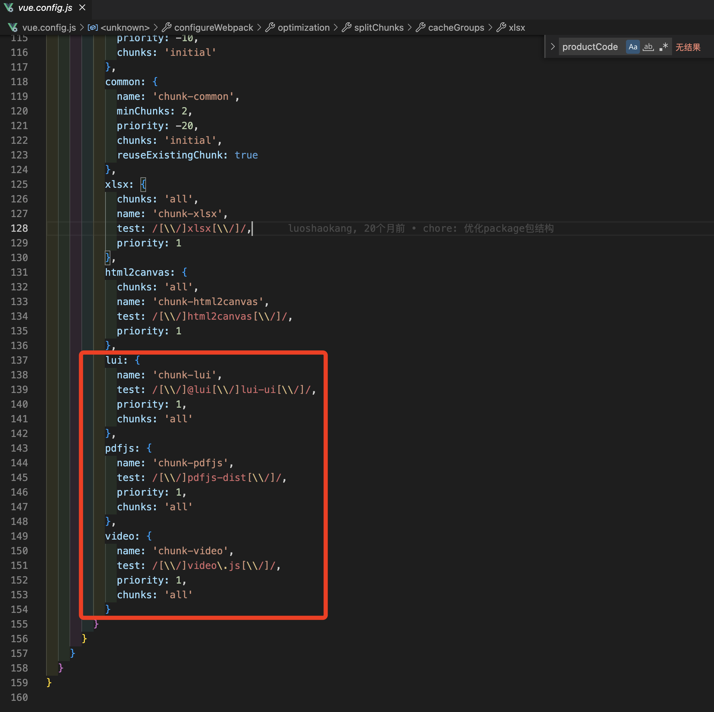
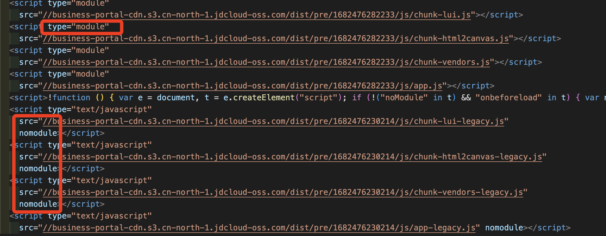
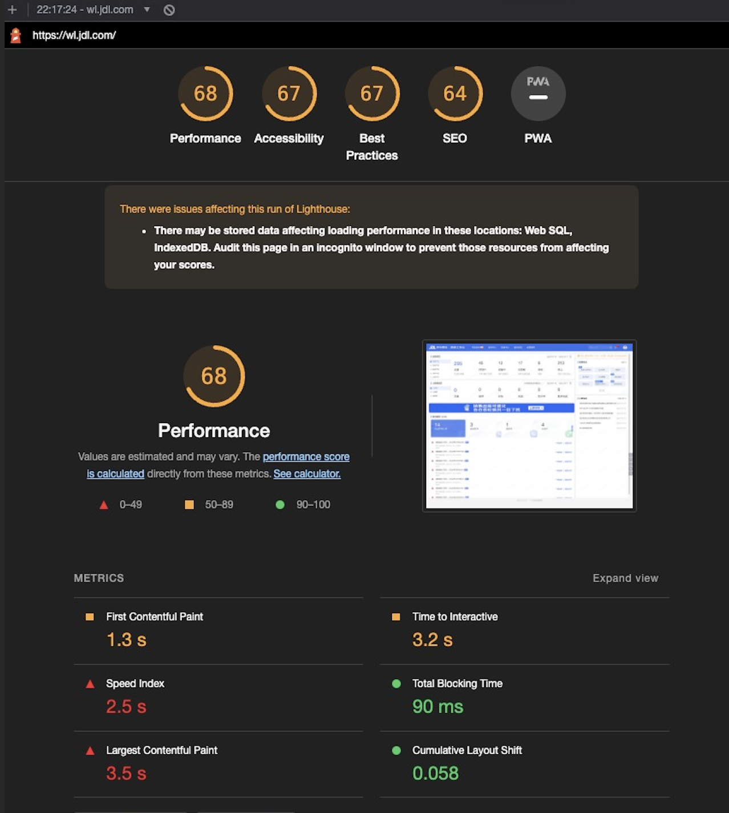
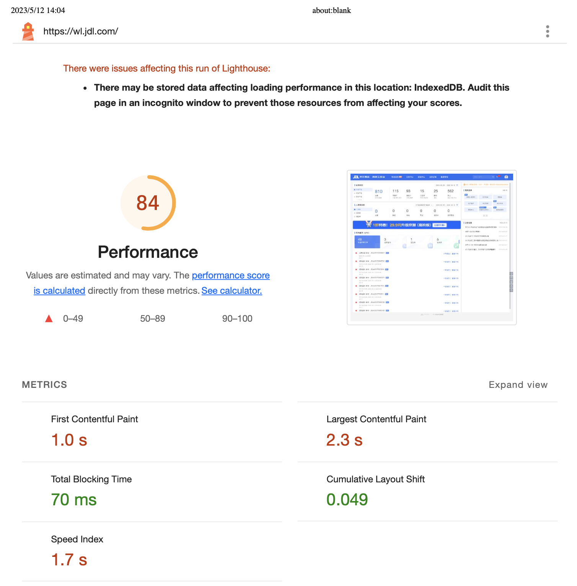
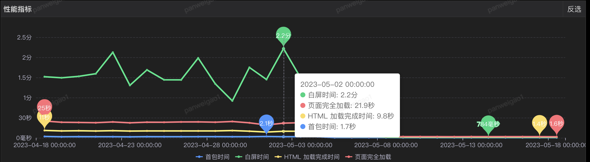
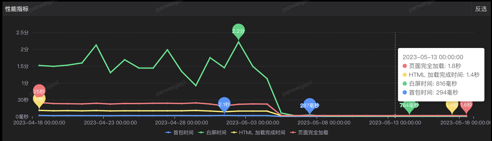

# 当前得分



# 网络优化

百万商家域名解析优化方案



## 商家工作台配置



# 本期优化方案

## 打包后的静态文件上传cdn，资源加载提速

```
// oss.config.js
/**
 * @desc cdn上传
 * @see http://npm.m.jd.com/package/@jdlc/webpack-oss-upload
*/

const cdnDomain = `${process.env.VUE_APP_CDN_BUCKET}.s3.cn-north-1.jdcloud-oss.com`
const prefix = `dist/${process.env.VUE_APP_CDN_ENV_PREFIX}/${Date.now()}/`

module.exports.OSSConfig = {
  bucket: process.env.VUE_APP_CDN_BUCKET,
  accessKeyId: process.env.VUE_APP_CDN_ACCESS_KEY_ID,
  secretAccessKey: process.env.VUE_APP_CDN_SECRET_ACCESS_KEY,
  cdnDomain,
  prefix,
  ignore: ['**/*.map', '**/*.html'],
  cacheControl: 'max-age=864000'
}
module.exports.cdnPublicPath = `//${cdnDomain}/${prefix}`
```


```
// 使用webpack的oss上传插件将打包后的文件上传到京东云oss
const plugins = []
const WebpackOssUploadPlugin = require('@jdlc/webpack-oss-upload')
const isUploadCdn = process.argv.includes('--cdn')
const { OSSConfig, cdnPublicPath } = require('./oss.config.js')

if (isUploadCdn) {
  plugins.push(new WebpackOssUploadPlugin(OSSConfig))
}
```


## webpack-bundle-analyzer分析包体积，进行分包

通过webpack-bundle-analyer分析打包体积，进行打包体积优化，减少首屏加载资源体积

webpack打包时增加lui、pdfjs、video分包



## 基于VUE-Cli的现代模式构建，减少不必要的资源加载*

Vue CLI 会产生两个应用的版本：一个现代版的包，面向支持[ES modules](https://jakearchibald.com/2017/es-modules-in-browsers/)的现代浏览器，另一个旧版的包，面向不支持的旧浏览器。

```
vue-cli-service build --modern
```

构建后的`index.html`会有包含type="module"和nomodule的script标签



参考文档：

[https://cli.vuejs.org/zh/guide/browser-compatibility.html#%E7%8E%B0%E4%BB%A3%E6%A8%A1%E5%BC%8F](https://cli.vuejs.org/zh/guide/browser-compatibility.html#现代模式)

本地测试优化0.3-0.4s


## sgm埋点库升级

sgm3.0.3在特殊场景下采集数据有误，升级到3.0.7会有改善，3.0.8会进一步优化（sgm运营提供）；快递中心使用2.8.0数据平稳，暂定2.8.0作为备选。当前线上使用版本为3.0.7


```
<script crossorigin src="https://sgm-static.jd.com/sgm-web-3.0.7.js" name="SGMH5" sid="a32f6c77cee2457e8f60d15e72284e98" pid="9HwAEg@qGO/B7zhZjWgtn0H"></script>
```

# 线上验证

> 优化代码于5月4日晚操作上线；

根据本地测试数据观察

- FCP：从1.3s降低到1.0s，优化23%
- LCP：从3.5s降低到2.3s，优化34%

根据sgm观察，指标已大幅度下降

优化前本地lighthouse测试：



优化后本地lighthouse测试：



优化前sgm统计数据：



优化后sgm统计数据：

