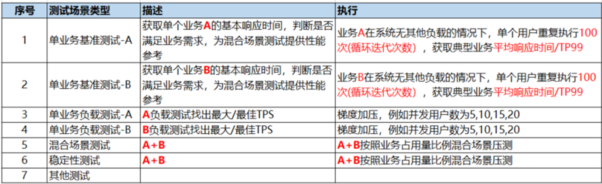
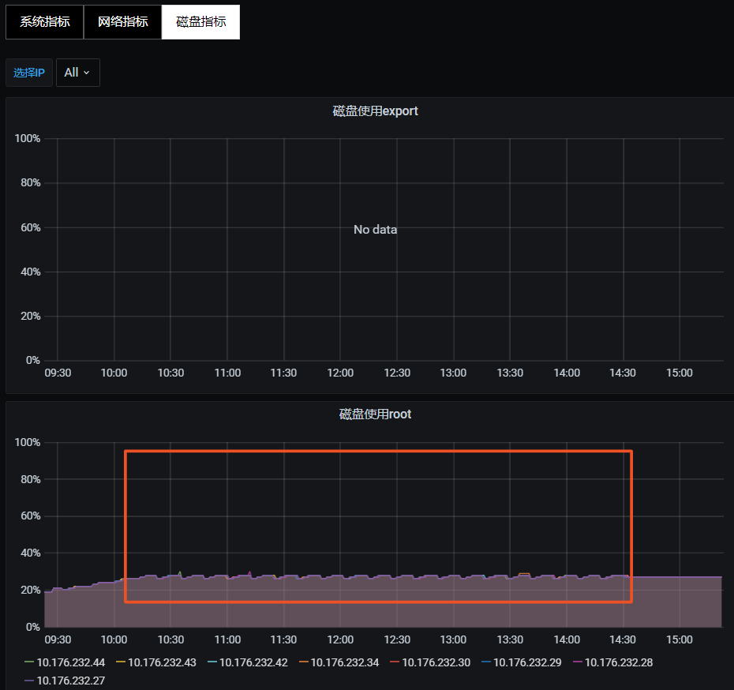
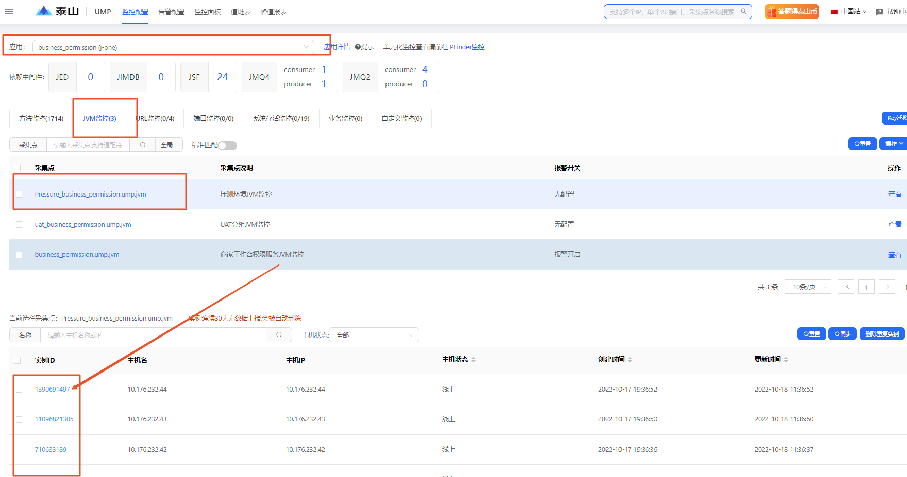
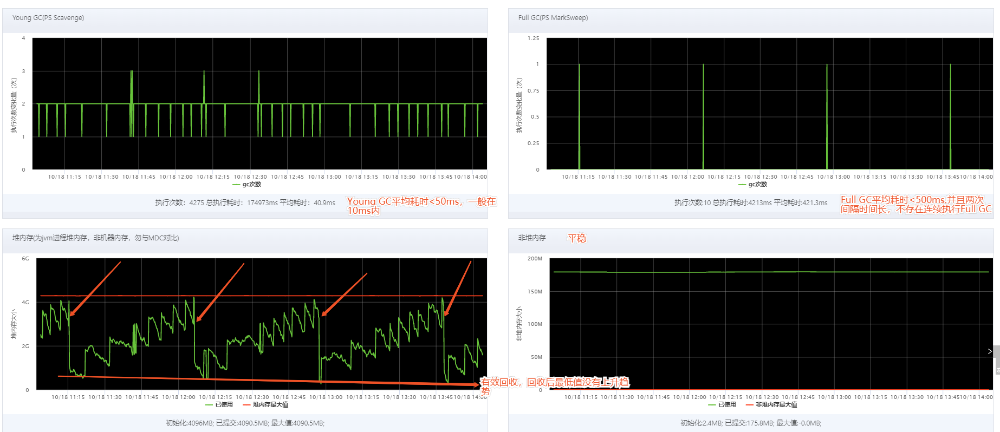
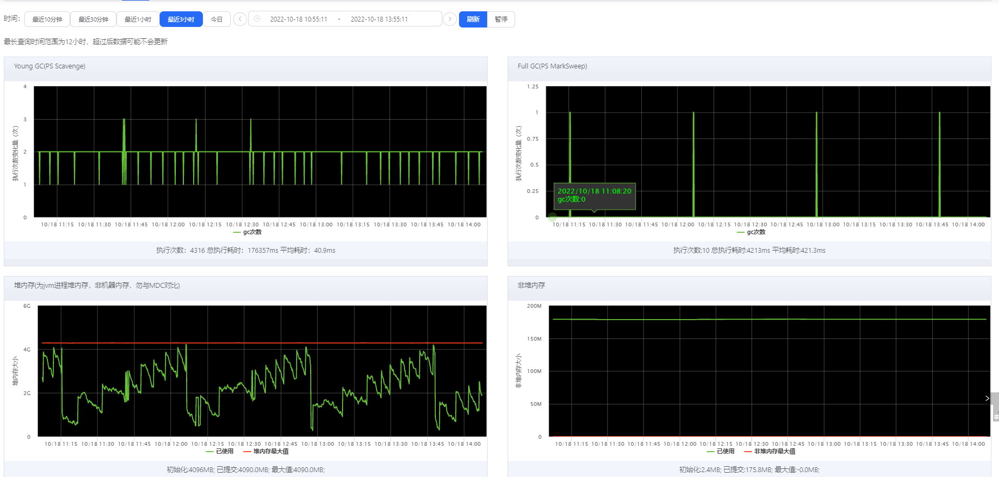

**生产环境稳定性压测一定低峰期执行，通知研发一起时刻关注服务可用率，关注监控报警**

稳定性测试是验证系统在长时间运行情况下，服务、性能、资源使用是否平稳，压测停止后系统资源是否有效回收。

1、场景选择：按业务比例，混合场景压测

2、压力设置：（1）目标值60%-80%时的压力，（2）应用CPU<40%  (3)数据库CPU小于40%，三者取压力最小值，即不要影响生产环境正常服务。

3、压测时间：如果在生产环境压测，选择业务低峰期执行，执行期间与研发一起时刻关注线上服务及资源情况

4、运行时长：稳定性测试常规执行7*24小时，考虑到我们业务情况，稳定性压测执行2-4小时

5、压测时监控内容

（1）服务性能：TPS、TP99、失败率等常规监控，注意变化趋势， TPS是否随时间逐渐减少、TP99是否随时间增大，失败率>0可能存在问题

（2）服务资源使用平稳：与压测统计维度一样，注意观察随时间是否有变化

磁盘使用平稳，不会持续增长

（3）JVM监控

在ump.jd.com上监控应用JVM使用及GC情况，选择jvm监控点，查看被压测服务jvm情况，压测前先检查是否已配置jvm监控点，没有请研发添加

观察内容：如图

