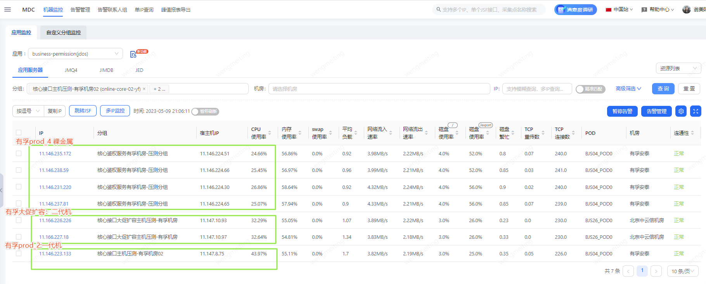
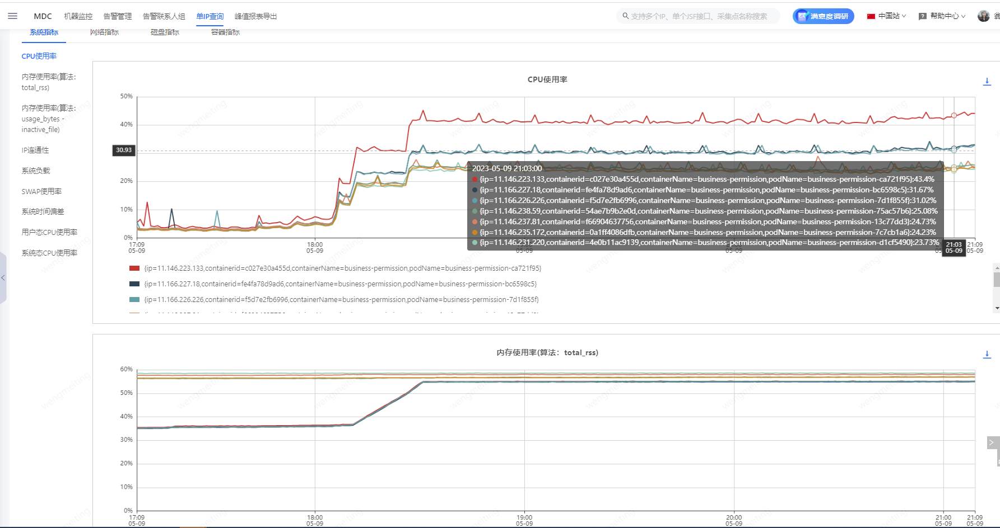
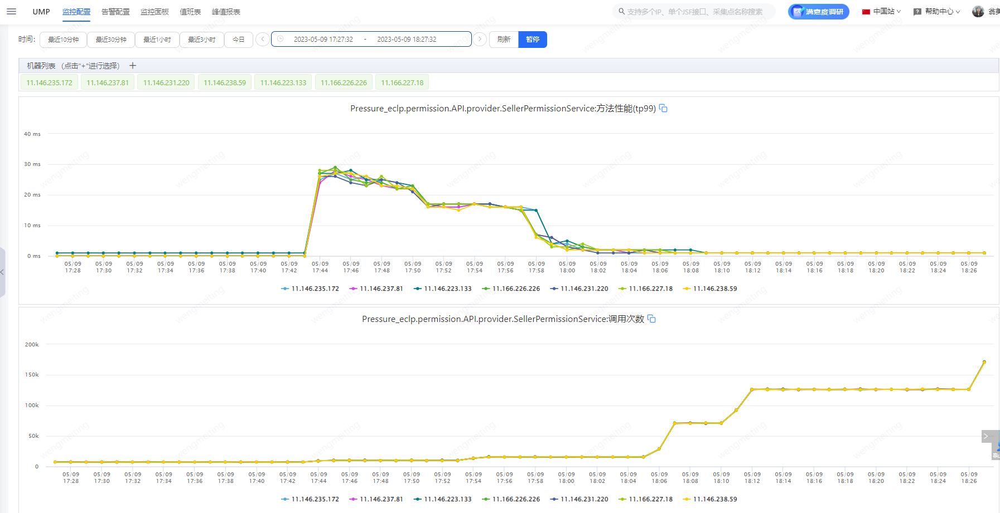
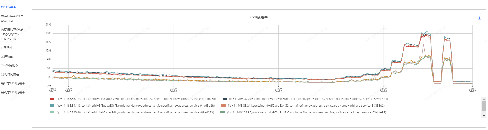
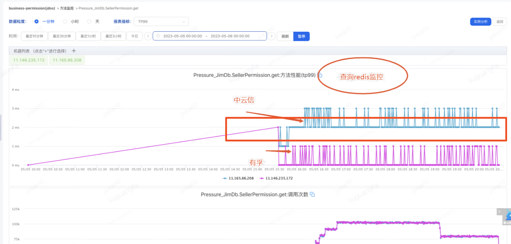
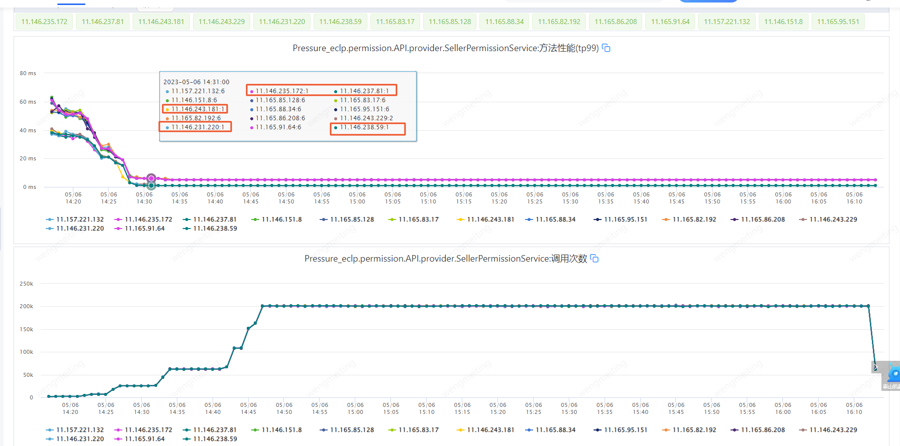
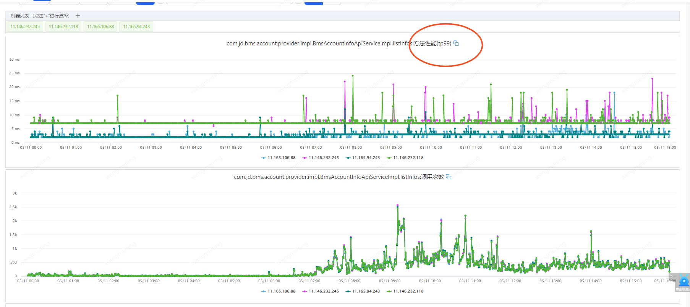

# 一、背景

迁移jdos服务器后首次经历大促，在618备战压测中增加服务多机房部署验证，评估系统性能情况。

# 二、结论

## **2.1 机器性能对比**

**压测对比发现相同压力下，机器性能裸金属>二代机>一代机。即裸金属机器CPU最低（裸金属有丢包不稳定现象，建议用二代机）。**

**建议：**

**（1）系统压测：**优先用prod_02（一代机）来压测，用性能相对最低的测试数据评估容器个数，cpu压到40%左右，单机能支撑tps去评估机器数量（以往j-one机器通常是按60%评估）。

**（2）线上部署：**0/1级应用建议部署二代机，zone选择prod_01，大促扩容分组都是二代机（prod_01为二代机建议选择，prod_02为一代机性能较差，metal和prod_04为裸金属性能最好，有丢包现象不稳定，运维不建议使用）。

**（3）后续**：大促后考虑仅用二代机，避免性能参差不齐情况。

## **2.2 跨机房性能对比**

**多个使用Redis的业务不同机房TP99存在5ms差异**，**分析为有孚与中云信之间专线延迟 1.1ms左右**，**业务逻辑通常get+set（缓存不存在，查询结果再set一次）出现跨机房5ms的响应时间差异。**（其他中间件压测中有发现机房tp99差异可按这个思路排查）

**建议：**

调用量和响应时间高敏感高要求的业务重点关注。

# 三、验证数据对比

## **3.1 机器性能对比**

裸金属、二代机、一代机性能对比：相同压力下不同类型机器CPU对比

裸金属CPU<二代机CPU<一代机性CPU，**即CPU性能：裸金属>二代机>一代机性**

### 案例1-压测对比

商家工作台权限压测对比，当机器压力相同时，不同类型机器CPU对比图：

此时查看UMP监控，各机器调用量相同：

### 案例2-生产对比

地址簿线上服务器对比

## **3.2 跨机房性能对比**

### 案例1：压测对比

以商家工作台权限为例，单次查询Redis跨机房多耗时2ms，业务get+set两次操作，存在5ms差异。

**商家工作台权限跨机房TP99对比：**

单次redis查询，Redis主节点部署在有孚机房：

业务维度TP99差异5ms左右：

### 案例2：生产对比

财务生产环境出现相似问题，Redis部署在中云信机房，应用部署在中云信机房的TP99较有孚低5ms左右

