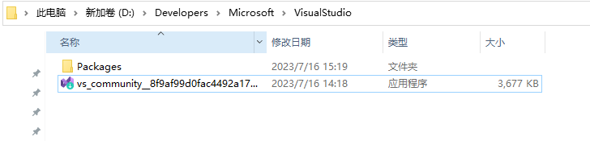
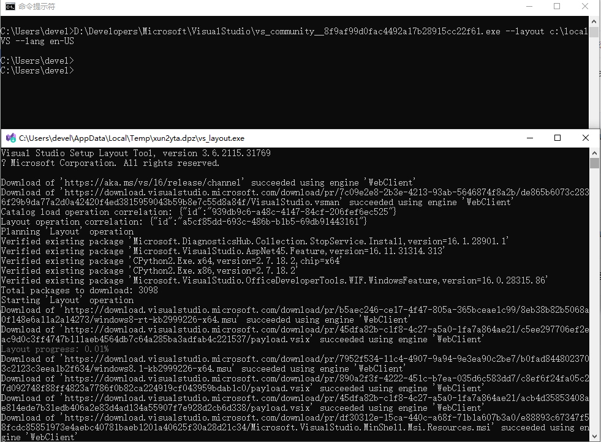

Visual Studio（简称VS）是微软公司的开发工具包系列产品，包括了整个软件生命周期中所需要的大部分工具，如UML工具、代码管控工具、集成开发环境（IDE）等等，并且几乎适用于所有开发平台。

本文主要介绍如何通过官方渠道下载Visual Studio 2019正式版的完整离线安装包，并且提供已下载好的离线安装包（包含中文和英语）。

**1、官方渠道获取离线安装包**

打开Visual Studio官网链接https://visualstudio.microsoft.com/zh-hans/，在当前页面左下角找到“Visual Studio IDE”，点击“下载Windows版”，在下拉菜单中点击想要下载的版本（社区版2019、专业版2019、企业版2019）

历史版本下载地址：https://docs.microsoft.com/en-us/visualstudio/releases/2019/history#release-dates-and-build-numbers

**2、创建文件夹用来存放安装包文件**

创建一个空的文件夹用来下载vs2019的离线安装包文件，将下载完成的vs引导程序移到此文件夹。



**3、找到自己需要安装的vs工作负载和组件id**

https://docs.microsoft.com/en-us/visualstudio/install/workload-component-id-vs-community?view=vs-2019&preserve-view=true#visual-studio-core-editor-included-with-visual-studio-community-2019

**4、下载离线安装包**

1. 用管理员身份打开“命令提示符”，切换到第二步创建的文件目录中。
2. 通过组件和工作负载列表来自定义本地缓存。
3. 对于 .NET Web 和 .NET 桌面开发，运行命令：

```
vs安装程序.exe --layout "指定离线包下载目录" --add 工作负载组件 (--add 工作负载2) --includeOptional/--includeRecommended --lang 语言
```

上诉命令参数意义如下：

--layout 位置：指定离线包到指定位置

--add 工作负载：添加一个工作负载，工作负载id对应将在下面列出。若要下载多个工作负载组件，可以多加几个--add参数

--includeOptional/--includeRecommended：安装所选的工作负载组里面的推荐项/安装所选工作负载里面全部可选项

--lang 语言：安装语言包，将会在下面给出语言列表

```
vs_community.exe --layout "D:\Visual Studio 2019\Packages" --add Microsoft.VisualStudio.Workload.ManagedDesktop --add Microsoft.VisualStudio.Workload.NetWeb --add Component.GitHub.VisualStudio --includeOptional --lang en-US
```

命令解释："D:\Visual Studio 2019\vs_community.exe"为安装程序的路径；"D:\Visual Studio 2019\Packages"为存放离线文件的文件夹路径；“zh-CN en-US”为需要安装的语言。

*对于 .NET 桌面和 Office 开发，运行命令：*

```
vs_community.exe --layout c:\localVScache --add Microsoft.VisualStudio.Workload.ManagedDesktop --add Microsoft.VisualStudio.Workload.Office --includeOptional --lang en-US
```

*对于 C++ 桌面开发，运行命令：*

```
vs_community.exe --layout c:\localVScache --add Microsoft.VisualStudio.Workload.NativeDesktop --includeRecommended --lang en-US
```

*要创建一个完整的本地缓存，只有英文，具有所有功能（这将需要很长时间 - 并且vs2019至少需要40GB的存储空间），运行命令：*

```
vs_community.exe --layout c:\localVScache --lang en-US
```

**5、如下图，则正在下载安装文件，进度到100%，则下载安装包完成：**



**6、最后把下载好的文件夹拷贝到局域网的电脑中，点击vs_setup.exe，即可进行离线安装。**

**7、后续需要添加其他的组件id和工作负载，可以继续通过引导程序在此文件夹中通过命令下载离线安装包文件。**