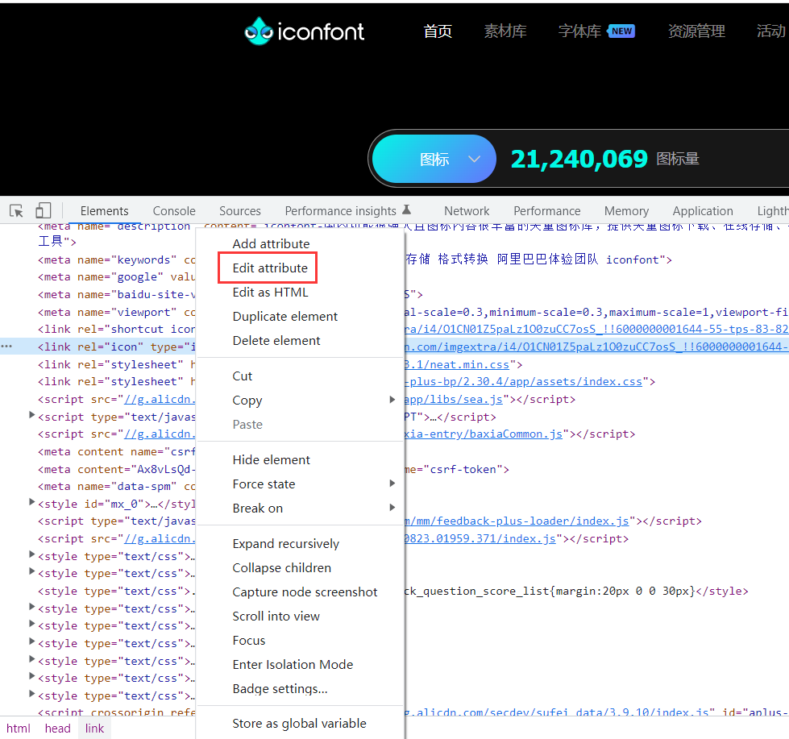

网页logo图标一般是指favicon图标，作为缩略的网站标志，一般显示于浏览器的地址栏或者在标签上。

如图中红圈的位置， 即是favicon图标。

favicon的格式不一定是ico格式，它可以是png，jpg甚至是gif，不过ico格式是所有浏览器都支持的。

最近在做自己的网址导航，需要提取和显示网址的favicon图标，使导航链接除了文字名称，前面还有更明显的logo标志，使选择和查看都更加便捷。

**那么怎么获取网页logo图标的URL链接呢？有三种方法。**

1. 最常用的方法（适用于90%的站点）是，直接在访问网址首页链接后加上 /favicon.ico，例如：https://www.baidu.com/favicon.ico

2. 第二种获取方法，需要在浏览器界面按F12键，进入开发者模式（建议使用google内核浏览器）。在默认的“Elements”中点开<head>...</head>找到<link 中含有favicon或ico的链接，右键点选“Edit attribute“（即编辑属性）以复制该链接，粘贴到空白页面后回车后即显示该网站的logo图标。

   

   说明：有的链接前缀格式是//开头的，建议使用作为URL链接时前面加上https:

   例如

   //img.alicdn.com/imgextra/i4/O1CN01Z5paLz1O0zuCC7osS_!!6000000001644-55-tps-83-82.svg

   改成

   https:////img.alicdn.com/imgextra/i4/O1CN01Z5paLz1O0zuCC7osS_!!6000000001644-55-tps-83-82.svg

3. 第三种方法，使用第三方的矢量logo图标素材，如60logo、WorldVectorLogo（不支持中文搜索）这些网站有很多，可以找到所需的logo或自定义logo，还是很方便的。