IntelliJ IDEA是一款强大的Java集成开发环境（IDE），提供了丰富的功能和工具，以支持开发人员的日常工作。通过对IDEA进行合理的配置，可以使得IDEA更好地满足开发人员的个性化需求，提高开发效率、优化系统性能、增强项目管理能力和自定义开发环境。
提高开发效率：通过合理的配置，可以使得IDEA更好地满足开发人员的个性化需求，从而提高开发效率。例如，自定义代码风格可以确保团队成员之间的代码风格一致，减少因代码风格不一致而导致的沟通成本。
优化系统性能：对于内存较大的64位操作系统，通过调整IDEA的VM配置文件参数（如-Xms和-Xmx），可以优化IDEA的内存使用，从而提高系统的运行效率。
增强项目管理能力：IDEA的配置功能还包括对项目和任务的管理。通过配置Project的tasks记录，可以方便地跟踪和管理项目的进度和状态。
自定义开发环境：开发人员可以根据自己的喜好和需求，自定义IDEA的开发环境，包括界面主题、字体大小、快捷键等。这有助于打造一个更加舒适和高效的开发环境。
总之，IDEA的配置功能对于开发人员来说是非常重要的。通过合理的配置，可以使得IDEA更好地满足开发人员的个性化需求，提高开发效率、优化系统性能、增强项目管理能力和自定义开发环境。

<table><tr><td bgcolor=DarkSeaGreen>IDEA设置1-设置项目文件编码</td></tr></table>

每当创建一个新项目第一件事情就是设置好项目的编码再写代码，否则中文会出现乱码。
在IntelliJ IDEA中设置项目文件编码，可以按照以下步骤进行操作：

1. 打开 IntelliJ IDEA，并打开你的项目。
2. 在菜单栏中选择 "File"（文件） -> "Settings"（设置）。
3. 在弹出的设置窗口中，找到 "Editor"（编辑器） -> "File Encodings"（文件编码）。
4. 在 "File Encodings" 部分，你可以看到多个编码选项。这里有三个关键选项需要注意：

- Project Encoding（项目编码）：这是你项目的默认编码。你可以点击右侧的下拉框，选择适合你项目的编码格式。
- Default encoding for properties files（属性文件的默认编码）：如果你的项目中使用了一些属性文件，你可以在这里选择属性文件的默认编码。
- Transparent native-to-ascii conversion（透明的本地到ASCII转换）：如果你的项目中包含非ASCII字符，你可以勾选此选项将其自动转换为ASCII字符。

1. 根据你的需求，修改相应的编码选项，建议选择UTF-8编码。
2. 确保点击 "Apply"（应用）或 "OK"（确定）按钮保存设置。

通过以上步骤，你就可以在 IntelliJ IDEA 中成功设置项目文件编码了。请注意，此设置会影响项目中所有文件的编码格式。如果你的项目中有特定的文件需要使用不同的编码，你可以在文件级别上进行单独的设置。
操作步骤如下：

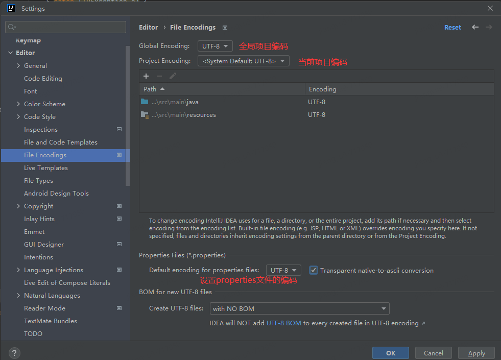

<table><tr><td bgcolor=DarkSeaGreen>IDEA设置2-设置控制台编码</td></tr></table>

设置控制台的字符编码，否则中文会出现乱码。
在IntelliJ IDEA中设置控制台编码，可以按照以下步骤进行操作：

1. 打开 IntelliJ IDEA，并打开你的项目。
2. 在菜单栏中选择 "File"（文件） -> "Settings"（设置）。
3. 在弹出的设置窗口中，找到 "Editor"（编辑器） -> "General"（通用） -> "Console"（控制台）。
4. 在 "Console" 部分，你可以看到一个编码选项：

- Default Encoding（默认控制台编码）：表示使用指定的编码格式作为控制台的编码。

1. 根据你的需求，修改相应的编码选项，建议使用UTF-8编码。
2. 确保点击 "Apply"（应用）或 "OK"（确定）按钮保存设置。

通过以上步骤，你就可以在 IntelliJ IDEA 中成功设置控制台编码了。请注意，控制台编码设置会影响在运行程序时控制台输出的文本的显示方式。如果你的程序需要处理特定的编码格式，你可能还需要在代码中进行相关的编码转换操作。

<table><tr><td bgcolor=DarkSeaGreen>IDEA设置3-设置类的文档注释</td></tr></table>

在IntelliJ IDEA中，可以使用以下方法设置类的文档注释：

1. 打开 IntelliJ IDEA，并打开你的项目。

2. 在菜单栏中选择 "File"（文件） -> "Settings"（设置）。

3. 在弹出的设置窗口中，找到 "Editor"（编辑器） -> "File and Code Templates"（文件和代码模版） -> "Includes"（包含）> "File Header"（文件头部）

4. 在"File Header"（文件头部）右边的编辑区输入类文档注释的模板。

5. 确保点击 "Apply"（应用）或 "OK"（确定）按钮保存设置。

```
/**
* ClassName: ${NAME}
* Package: ${PACKAGE_NAME}
* @Author 砳砳
* @Create ${DATE} ${TIME} 
*/
```

下列是IDEA官网提供常用的预设变量，可以根据需求使用对应的预设变量：

| 预设变量              | 说明                                                         |
| :-------------------- | :----------------------------------------------------------- |
| `${PACKAGE_NAME}`     | 将在其中创建新类或接口的目标包的名称。                       |
| `${PROJECT_NAME}`     | 当前项目的名称。                                             |
| `${FILE_NAME}`        | 将要创建的文件的名称。                                       |
| `${NAME}`             | 您在创建文件的过程中，在 “新建文件” 对话框中指定的新文件的名称。 |
| `${USER}`             | 当前用户的登录名。                                           |
| `${DATE}`             | 当前系统日期。                                               |
| `${TIME}`             | 当前系统时间。                                               |
| `${YEAR}`             | 本年。                                                       |
| `${MONTH}`            | 本月。                                                       |
| `${DAY}`              | 当月的当前日期。                                             |
| `${HOUR}`             | 当前小时。                                                   |
| `${MINUTE}`           | 当前分钟。                                                   |
| `${PRODUCT_NAME}`     | 将在其中创建文件的 IDE 的名称。                              |
| `${MONTH_NAME_SHORT}` | 月份名称的前3个字母。示例：1月，2月等。                      |
| `${MONTH_NAME_FULL}`  | 一个月的全名。示例：1月，2月等。                             |

<table><tr><td bgcolor=DarkSeaGreen>IDEA设置4-修改注释颜色</td></tr></table>

有很多用户不喜欢默认的注释颜色，用户可以根据自己的喜好修改注释颜色，要修改IntelliJ IDEA中注释的颜色，可以按照以下步骤进行操作：

1. 打开IntelliJ IDEA并导航到"File"（文件）菜单。
2. 选择"Settings"（设置）选项。
3. 在弹出的设置窗口中，找到并点击"Editor"（编辑器）选项。
4. 在"Editor"选项下，选择"Color Scheme"（颜色方案）。
5. 在右侧的窗格中，可以看到各种语法元素和编辑器组件的颜色设置。
6. 在左侧的树状目录中，展开"Comments"（注释）选项。
7. 在注释选项下，您可以看到"Line comment"（单行注释）、"Doc comment"（文档注释）和"Block comment"（多行注释）的颜色设置。
8. 点击相应的注释选项，然后在右侧的颜色选择器中选择您想要的颜色。
9. 完成颜色选择后，点击"Apply"（应用）或"OK"（确定）按钮保存修改。

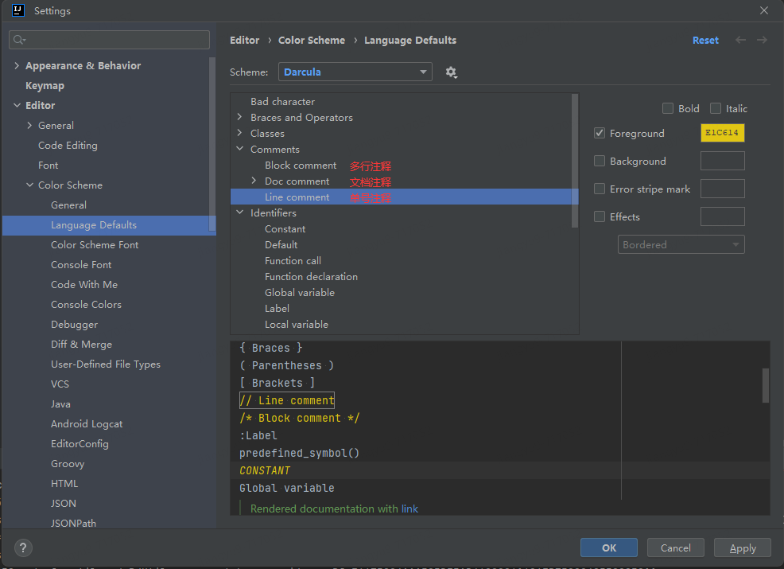

<table><tr><td bgcolor=DarkSeaGreen>IDEA设置5-修改注释开始位置</td></tr></table>

**修改代码注释**

在IDEA中，通过CTRL + / 快捷键给代码添加注释，默认是放在一行的头部开始位置，这样注释不好看也不符合代码规范，注释应该和代码一样要对齐和缩进的。要在IntelliJ IDEA中修改注释的开始位置，可以按照以下步骤进行操作：

1. 打开IntelliJ IDEA，并点击菜单栏中的"File"选项。
2. 在下拉菜单中选择"Settings"或者使用快捷键"Ctrl + Alt + S"打开设置面板。
3. 在设置面板中，展开"Editor"选项并选择"Code Style"。
4. 在右侧的面板中，选择"Java"（或其他您正在使用的编程语言）选项卡。
5. 在选项卡中，选择"Code Generation"选项。
6. 在"Comment Code"部分，您可以看到"Line comment at first column"选项。
7. 将该选项取消勾选，表示注释将会从代码的开始位置开始。
8. 点击"OK"保存并关闭设置面板。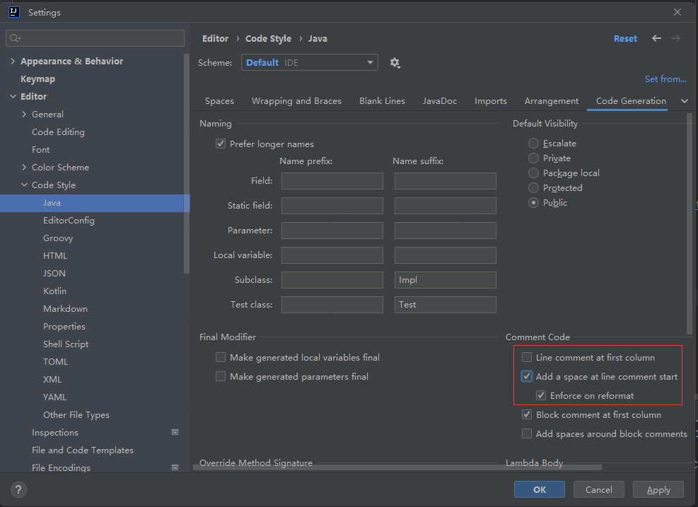

**修改XML注释**

在IDEA中，通过CTRL + / 快捷键给XML添加注释，默认是放在一行的头部开始位置，这样注释不好看也不符合代码规范，注释应该和代码一样要对齐和缩进的。用户可以修改IDEA的注释位置，操作步骤如下：

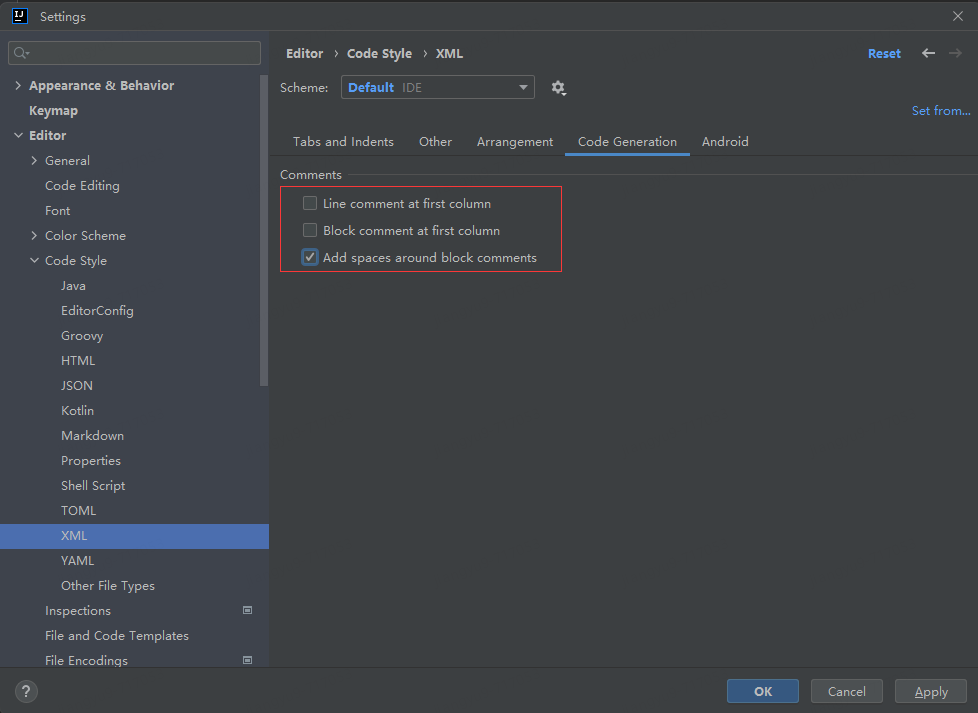

<table><tr><td bgcolor=DarkSeaGreen>IDEA设置6-显示方法分隔线</td></tr></table>

IDEA一个类中多个方法之间没有任何分隔，不方便阅读代码，用户可以在方法之间显示分隔线，方便阅读代码，要在IntelliJ IDEA中开启"show method separators"选项，可以按照以下步骤进行操作：

1. 打开IntelliJ IDEA，并点击顶部菜单栏中的"File"（文件）选项。
2. 在下拉菜单中选择"Settings"（设置）或使用快捷键"Ctrl + Alt + S"打开设置面板。
3. 在设置面板中，找到"Editor"（编辑器）选项，并展开它。
4. 在"Editor"下的子选项中，选择"General"（常规）。
5. 在常规设置中，找到"Appearance"（外观）选项。
6. 在外观选项中，勾选"Show method separators"（显示方法分隔符）复选框。
7. 点击"Apply"（应用）或"OK"按钮以保存更改。

开启"show method separators"选项后，您将在编辑器中看到在每个方法之间显示一条水平分隔线，以帮助您更清晰地区分不同的方法。请注意，方法分隔符仅在编辑器中可见，不会影响实际代码的执行。

<table><tr><td bgcolor=DarkSeaGreen>IDEA设置7-自动导入类</td></tr></table>

可以给IDEA设置自动导入类，在IntelliJ IDEA中，可以通过以下步骤设置自动导入类：

1. 点击顶部菜单栏中的"File"，然后选择"Settings"来打开设置面板。
2. 在设置面板中，展开"Editor"选项，然后选择"General"。
3. 在"General"选项卡中，可以找到"Auto Import"部分。
4. 在"Auto Import"部分，将"Insert imports on paste"选项设置为"Always"。这将确保在您粘贴代码时自动导入相关的类。
5. 还可以选择将"Optimize imports on the fly"选项设置为"Always"，以便在编码过程中自动优化（导入或删除）未使用的类。
6. 点击"Apply"或"OK"按钮来保存更改。

现在，在IntelliJ IDEA中粘贴代码或编写代码时，相关的类将自动导入。此外，未使用的类也会在编码过程中自动进行优化。这样可以提高您的开发效率并减少手动导入类的工作量。
操作步骤如下：

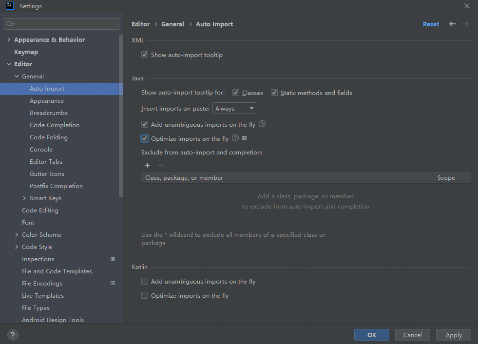

- Add unambiguous imports on the fly：动态导入明确的包
- Optimize imports on the fly：优化动态导入的包

设置完成后，当开发者在代码中使用一个未导入的类时，IDEA会自动导入该类。如果有多个同名的类，IDEA会提示开发者选择需要导入的类。此外，当开发者删除一个类或者修改了一个类的包名时，IDEA会自动更新代码中的导入类。这样可以大大提高开发效率，减少手动导入包的时间。

<table><tr><td bgcolor=DarkSeaGreen>IDEA设置8-启动时如何打开项目</td></tr></table>

在IntelliJ IDEA启动时，默认会自动打开上次使用的项目，并直接进入项目。IntelliJ IDEA可以设置启动时进入欢迎界面，让用户自己选择对应的项目。
要在IntelliJ IDEA中设置启动时进入欢迎界面，可以按照以下步骤进行设置：

1. 打开IDEA，并转到"File"（文件）菜单，然后选择"Settings"（设置）。
2. 在弹出的窗口中，选择"Appearance & Behavior"（外观和行为）选项，然后选择"System Settings"（系统设置）。
3. 在右侧的选项中，找到"Reopen projects on startup"（启动时重新打开上次的项目）复选框，并确保取消勾选它。
4. 点击"OK"（确定）按钮来保存更改。

现在，每次启动IntelliJ IDEA时，它都会进入欢迎界面，这样用户可以自己选择打开哪个项目。

<table><tr><td bgcolor=DarkSeaGreen>IDEA设置9-不区分大小写代码提示</td></tr></table>

IntelliJ IDEA默认代码提示和补全功能是区分大小写的，必须大小写一致才能匹配，比如输入`string`是不能匹配`String`的，如果想在IntelliJ IDEA中设置代码提示和补全不区分大小写，可以按照以下步骤进行操作：

1. 打开IntelliJ IDEA并打开"Settings"（设置）。
2. 在左侧窗格中，找到并点击"Editor"（编辑器）。
3. 在左侧窗格中，选择"General"（通用）选项卡。
4. 在左侧窗格中，选择"Code Completion"（代码完成）选项卡。
5. 在"Code Completion"（代码完成）部分，找到"Match case"（区分大小写）选项。
6. 取消选中"Match case"（区分大小写）。

完成上述步骤后，IntelliJ IDEA的代码提示将不再区分大小写。现在，当你输入代码时，它将忽略大小写并提供相应的代码提示。

<table><tr><td bgcolor=DarkSeaGreen>IDEA设置10-IDEA设置多行Tab</td></tr></table>

默认情况下IntelliJ IDEA无论打开多少文件都只会显示一行Tab，不方便查看源代码。通过设置多行 Tab，可以在 IntelliJ IDEA 的编辑器中显示更多的文件标签，提高多文件之间的切换效率。这对于同时工作于多个文件或模块的开发者来说非常有用。请注意，多行 Tab 的显示数量受到屏幕空间的限制。如果你的屏幕空间有限，可能无法完全显示所有的文件标签。在这种情况下，你可以使用左侧和右侧的箭头按钮来滚动浏览标签。
IntelliJ IDEA允许配置显示多行Tab，要在IntelliJ IDEA中设置多行选项卡，可以按照以下步骤进行操作：

1. 在菜单栏中选择 "File"（文件）。
2. 在下拉菜单中选择 "Settings"（设置）。
3. 在弹出的窗口中，选择 "Editor"（编辑器）。
4. 在 "Editor" 选项下，选择 "General"（常规）。
5. 在右侧面板中找到 "Editor Tabs"部分。
6. 在右侧找到 "Tab Placement"（选项卡位置）下拉菜单，选择 "Top"（顶部）。
7. 取消勾选`Show tabs in one row`（在一行显示选项卡）。
8. 点击 "OK"（确定）按钮保存设置。

这样，就可以在IntelliJ IDEA中启用多行选项卡了。

<table><tr><td bgcolor=DarkSeaGreen>IDEA设置11-IDEA一个应用多次启动</td></tr></table>

`大纲`
IDEA设置一个应用多次启动介绍
IDEA设置一个应用多次启动方式一，设置应用程序允许并行运行
IDEA设置一个应用多次启动方式二，复制一个应用程序

`IDEA设置一个应用多次启动介绍`
在 IntelliJ IDEA 中，当重复启动同一个应用程序时，会弹出提示框，提示开发人员程序不允许并行运行，只能选择`Stop and Rerun`停止当前程序并重新启动。有时候可能需要同时运行多个相同的应用程序实例，每个实例都有独立的运行环境和状态。用于调试和测试多线程、并发或分布式应用程序等特殊情况。
在 IntelliJ IDEA 中，可以通过以下两种方式设置一个应用程序可以多次启动：

`IDEA设置一个应用多次启动方式一，设置应用程序允许并行运行`

步骤如下：

1. 打开 IntelliJ IDEA，并打开项目。
2. 在顶部菜单栏中选择 "Run" > "Edit Configurations…"（或者使用快捷键 Shift + Alt + F10）。
3. 弹出的 "Run/Debug Configurations" 窗口中，在左侧选中要启动多次的应用程序名。
4. 点击`Modify options`，弹出`Add Run Options`对话框。
5. 在`Add Run Options`对话框选中`Allow multiple instances`（或者使用快捷键 Alt + U）。
6. 点击 "OK" 保存配置。

操作步骤如下：

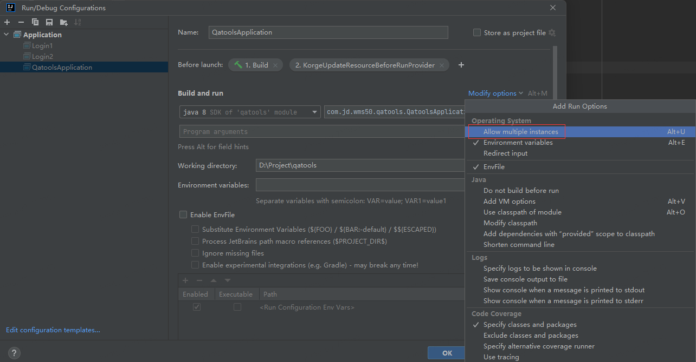

`IDEA设置一个应用多次启动方式二，复制一个应用程序`

步骤如下：

1. 打开 IntelliJ IDEA，并打开项目。

2. 在顶部菜单栏中选择 "Run" > "Edit Configurations…"（或者使用快捷键 Shift + Alt + F10）。

3. 弹出的 "Run/Debug Configurations" 窗口中，在左侧选中要启动多次的应用程序名。

4. 点击上方的复制按钮。

5. 给赋值的应用程序修改名称。

6. 点击 "OK" 保存配置。

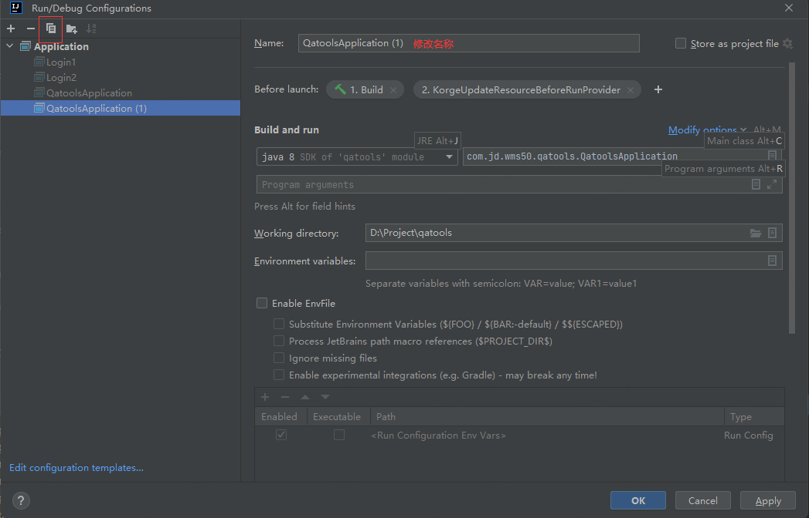

<table><tr><td bgcolor=DarkSeaGreen>IDEA设置12-设置项目文件编码</td></tr></table>

在使用IDEA进行Java开发时，经常需要编写MyBatis的Mapper接口映射文件，每次手动编写太麻烦了，可以使用IDEA的`File and Code Templates`设置模版，以后只要新建文件即可。
在IntelliJ IDEA中要自定义文件和代码模板，可以按以下步骤操作：

1. 打开IDE设置，快捷键为`Ctrl+Alt+S`，然后选择`Editor`-> `File and Code Templates`。
2. 在页面上，可以看到许多定义好的模板，包括文件、包含和代码等模板类型。
3. 可以创建或修改模板，例如在File Header模板中加入作者、版本等信息。
4. 对于文件模板，可以指定文件名、文件扩展名和模板内容。

具体操作如下：

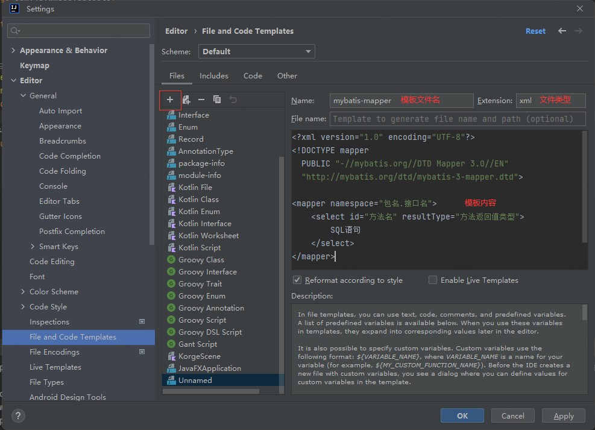

模板内容如下：

```xml
<?xml version="1.0" encoding="UTF-8"?>
<!DOCTYPE mapper  
  PUBLIC "-//mybatis.org//DTD Mapper 3.0//EN"  
  "http://mybatis.org/dtd/mybatis-3-mapper.dtd">

<mapper namespace="包名.接口名">
    <select id="方法名" resultType="方法返回值类型">
        SQL语句
    </select>
</mapper>
```

通过以上操作就设置好了模板，接下来就是使用刚刚创建好的模板了。
可以看到在New菜单中就多了一项刚刚自定好的模板`mybatis-mapper`。

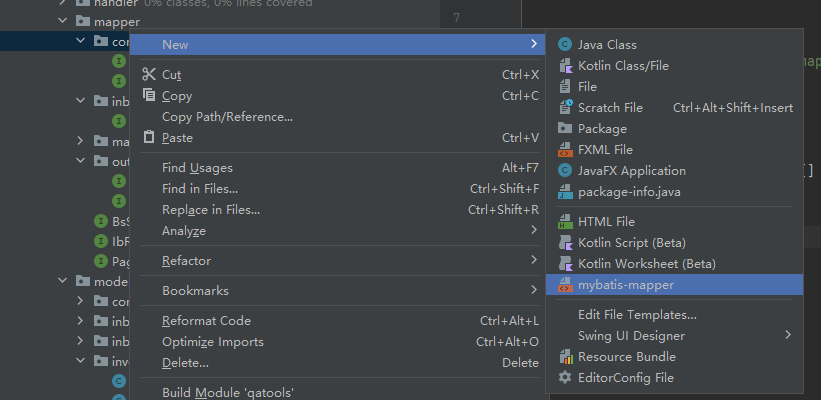

新建刚刚创建的模板，弹出新建文件对话框，只需要输入文件名称就行，文件后缀我们在模板中已经设置好了。

<table><tr><td bgcolor=DarkSeaGreen>IDEA设置1-设置项目文件编码</td></tr></table>


<table><tr><td bgcolor=FF5809>Plugins</td></tr></table>

<table><tr><td bgcolor=F00078>GsonFormat</td></tr></table>

Json转Java类，该插件可以加快开发进度，使用非常方便，效率高。

<table><tr><td bgcolor=F00078>Rainbow Brackets</td></tr></table>

它可以实现配对括号相同颜色，并且实现选中区域代码高亮的功能。对增强写代码的有趣性和排错等都有一些帮助。

<table><tr><td bgcolor=F00078>JRebel and XRebel</td></tr></table>

## **JRebel简介**

JRebel是一款实现热部署的开发工具，它可以允许你在启动程序时修改java代码直接进行编译生效，无须手动重启。热部署的实现会为你节省了大量重启时间，明显提高个人开发效率。

## **激活JReable**

下载反向代理软件
根据自己的系统下载对应版本，window系统需要下载ReverseProxy_windows_amd64.exe这个版本，下载地址：

[https://github.com/ilanyu/ReverseProxy/releases/tag/v1.4](https://github.com/ilanyu/ReverseProxy/releases/tag/v1.4)

（注意：激活成功前不要关闭反向代理程序）

在idea中如下步骤点击：File ——> Setting... ——> JRebel ——> Activate now。打开激活窗口，需要填入license的地址和邮箱，后面的邮箱可以随便写一个，license地址则需要使用我们刚才开启的工具上显示的地址：[http://127.0.0.1:8888](https://link.zhihu.com/?target=http%3A//127.0.0.1%3A8888/)，而且地址必须跟一个参数（必须要写用UUID或者GUID，而UUID这种重复的几率非常低。在线GUID地址：[https://www.guidgen.com/](https://link.zhihu.com/?target=https%3A//www.guidgen.com/)）

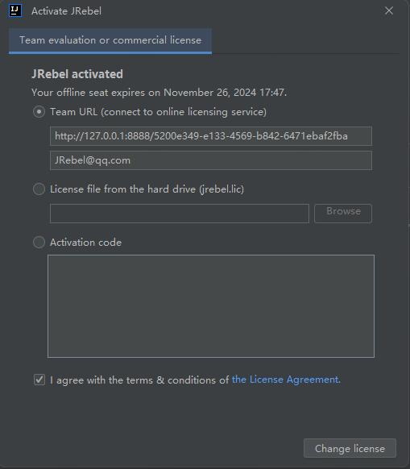

然后点击Activate JRebel就可以激活了。激活成功后点击`Work offline`切换到离线状态。

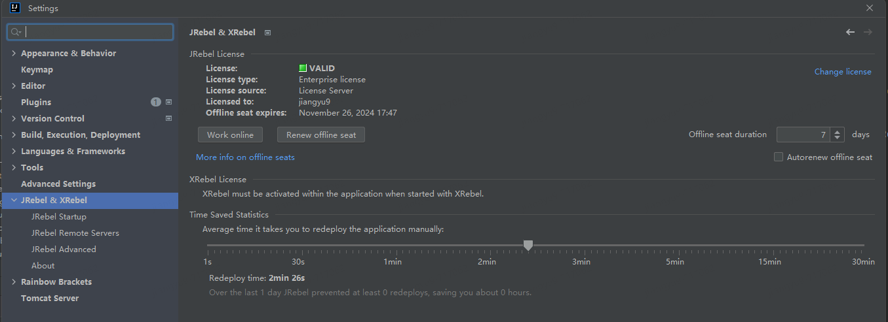