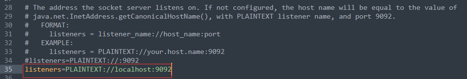
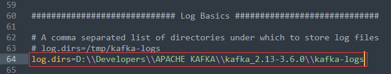
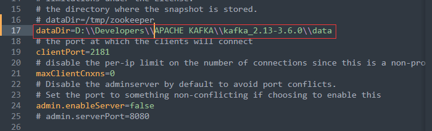
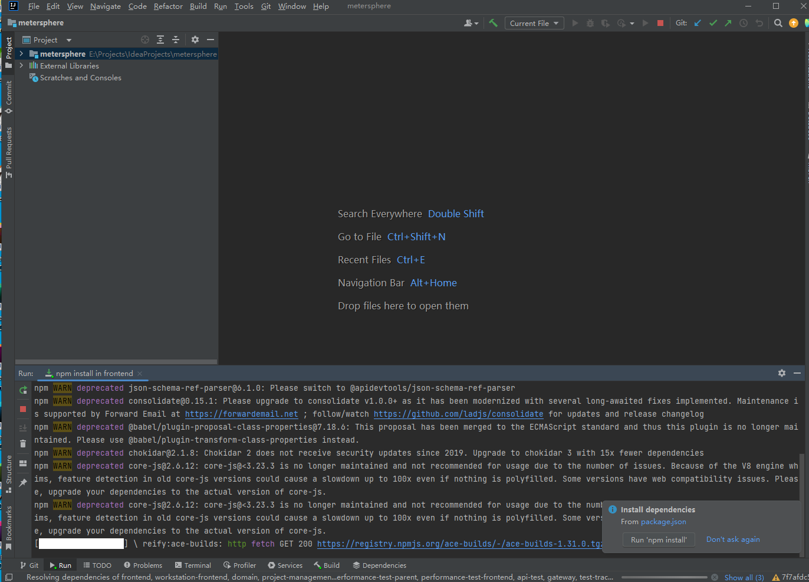

安装Apache Kafka

Kafka是一种高吞吐量的分布式发布订阅消息系统。详细介绍可查阅官网：https://kafka.apache.org/downloads

kafka的运行需要依赖zookeeper，已经内置了zookeeper，所以不需要再安装zookeeper。想要启动kafka需要修改kafka配置文件和zookeeper配置文件，配置文件都在根目录下面的config文件夹下。

- kafka 服务端配置在server.properties中。kafka配置需要修改两处配置文件：listeners 和 log.dirs

  - listeners：服务器监听的地址，修改如下：listeners=PLAINTEXT://localhost:9092

  

  - log.dirs：日志文件修改为自定义的日志目录

  

- zookeeper配置文件为zookeeper.properties。只需修改一处，dataDir：zookeeper存储数据的路径修改自定义的目录，要用反斜杠/

  

测试Apache Kafka

进入kafka安装根目录下，地址栏输入cmd，然后回车，**通过命令行启动之后不要关闭窗口。**

（1）先启动zookeeper，启动命令如下：

```
.\bin\windows\zookeeper-server-start.bat .\config\zookeeper.properties
```


项目克隆后，安装依赖。

